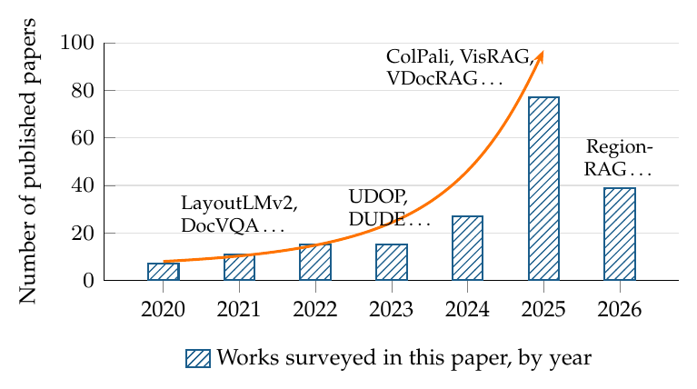
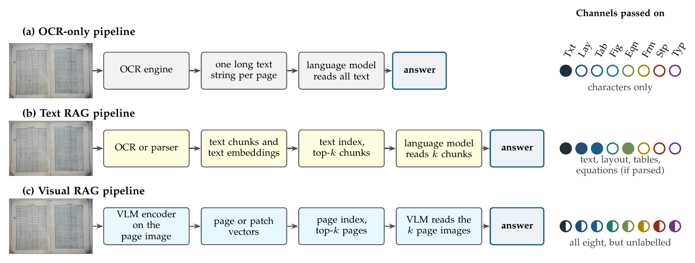
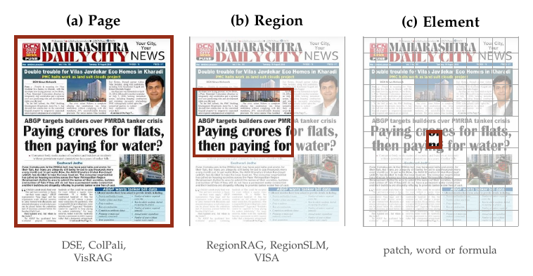
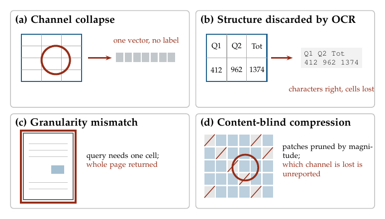
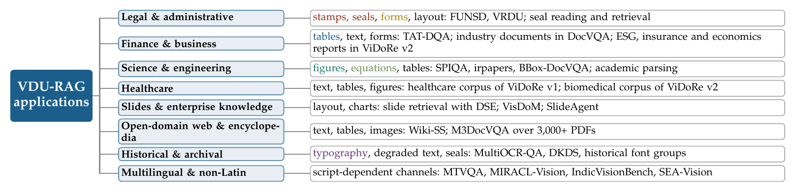
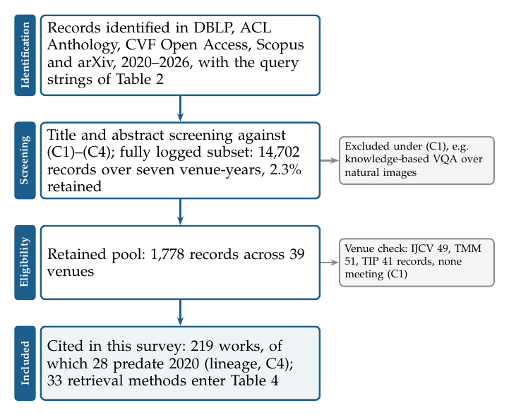

## Awesome Retrieval-Augmented Visual Document Understanding [](https://awesome.re)


This is the repository of **A Survey of Retrieval-Augmented Generation for Visual Document Understanding**, a survey that organises the field by the **eight content channels** a document page carries (plain text, layout, tables, figures and charts, equations, form fields, stamps and seals, typography) and asks which of them survive retrieval.

*Under review at IEEE Transactions on Pattern Analysis and Machine Intelligence (TPAMI).*

[](https://github.com/visualdocumentrag/VDU-RAG-Survey/commits/main) [](CONTRIBUTING.md) [](LICENSE)

*Feel free to open a pull request or an issue if a related paper is missing.* To add a paper, append a row in the following format to the right section and explain in the pull request which channel it reports results on:

```
|[Title](Paper link)|Venue Year|[Code](Code link)|
```

📅 Snapshot of 31 August 2026 (the survey's cut-off).

## Overview

- **Channel interference.** Retrieval encoders pool a page into vectors without recording which channel each region came from; late-interaction scoring makes channels compete even when they do not touch.
- **A channel × paradigm matrix.** 33 retrieval methods and 25 benchmarks audited per channel: no retrieval method or benchmark covers stamps or typography.
- **A routing rule for OCR vs. pixels**, a channel-aware retrieval score (CARS), and an 18-item reporting checklist.

<p align="center"> </p>

## Citation

If you find this repository useful, please cite:

```bibtex
@article{vdurag2026survey,
  title   = {A Survey of Retrieval-Augmented Generation for Visual Document Understanding},
  author  = {Pramanik, Subrata and others},
  journal = {IEEE Transactions on Pattern Analysis and Machine Intelligence},
  note    = {Under review},
  year    = {2026}
}
```

## Menu
- [Evolution](#evolution)
- [Surveys](#surveys)
- [Datasets](#datasets)
  - [Retrieval & RAG](#retrieval--rag)
  - [Document QA](#document-qa)
  - [Channel-specific](#channel-specific)
- [Retrieval and RAG Methods](#retrieval-and-rag-methods)
  - [Screenshot embedding](#screenshot-embedding)
  - [Late interaction](#late-interaction)
  - [End-to-end visual RAG](#end-to-end-visual-rag)
  - [Region and layout level](#region-and-layout-level)
  - [Agentic](#agentic)
- [Representative Systems (EIOAR)](#representative-systems-eioar)
- [Channel-wise Papers](#channel-wise-papers)
- [Applications](#applications)
- [Design and Reporting Checklist](#design-and-reporting-checklist)

## Evolution


Since the first page-image retrievers, the field has moved along three axes: the retrieved unit (page to region), the index (one vector to adaptive vectors) and the pipeline (single pass to agents).



The three dominant pipelines (OCR-only, text RAG, visual RAG) and the content channels each passes on to the reader.



## Surveys

|Title|Venue|Code|
|---|---|---|
|A Survey on MLLM-based Visually Rich Document Understanding: Methods, Challenges, and Emerging Trends|ACL Findings 2026|-|
|[Beyond Human Annotation: Recent Advances in Data Generation Methods for Document Intelligence](https://arxiv.org/abs/2601.12318)|arXiv 2026|-|
|[Deep Learning based Visually Rich Document Content Understanding: A Survey](https://arxiv.org/abs/2408.01287)|AI Review 2026|-|
|[Large Language Models in Document Intelligence: A Comprehensive Survey, Recent Advances, Challenges and Future Trends](https://doi.org/10.1145/3768156)|ACM TOIS 2026|-|
|[Scaling Beyond Context: A Survey of Multimodal Retrieval-Augmented Generation for Document Understanding](https://arxiv.org/abs/2510.15253)|ACL 2026|-|
|[Unlocking Multimodal Document Intelligence: From Current Triumphs to Future Frontiers of Visual Document Retrieval](https://arxiv.org/abs/2602.19961)|arXiv 2026|-|
|[A Survey of Multimodal Retrieval-Augmented Generation](https://arxiv.org/abs/2504.08748)|arXiv 2025|-|
|Ask in Any Modality: A Comprehensive Survey on Multimodal Retrieval-Augmented Generation|ACL Findings 2025|-|
|[Document Intelligence in the Era of Large Language Models: A Survey](https://arxiv.org/abs/2510.13366)|arXiv 2025|-|
|Multimodal Large Language Models for Text-rich Image Understanding: A Comprehensive Review|ACL Findings 2025|-|
|[Reproducibility, Replicability, and Insights into Visual Document Retrieval with Late Interaction](https://doi.org/10.1145/3726302.3730285)|SIGIR 2025|-|
|[Retrieval Augmented Generation and Understanding in Vision: A Survey and New Outlook](https://arxiv.org/abs/2503.18016)|arXiv 2025|-|
|[Roles of MLLMs in Visually Rich Document Retrieval for RAG: A Survey](https://arxiv.org/abs/2601.03262)|IJCNLP-AACL 2025|-|
|[Survey on Question Answering over Visually Rich Documents: Methods, Challenges, and Trends](https://arxiv.org/abs/2501.02235)|arXiv 2025|-|
|[Document Parsing Unveiled: Techniques, Challenges and Prospects for Structured Information Extraction](https://arxiv.org/abs/2410.21169)|arXiv 2024|-|
|Visual Document Understanding: A Comparative Review of Modern Methods|ICCV 2024|-|
|[Retrieval-Augmented Generation for Large Language Models: A Survey](https://arxiv.org/abs/2312.10997)|arXiv 2023|-|

## Datasets

Scope: ML = multilingual, MD = multi-domain, MT = multi-type, MM = multi-modality (only when stated by the dataset's authors). A blank Size, Queries or Metric cell is not reported in a form we could verify. Channels: ● annotated, ○ present but not annotated, – absent. Machine-readable: [`data/datasets.csv`](data/datasets.csv).

### Retrieval & RAG

|Dataset|Year|Lang.|Scope|Size|Queries|Metric|Txt|Lay|Tab|Fig|Eqn|Frm|Stp|Typ|Link|
|---|---|---|---|---|---|---|---|---|---|---|---|---|---|---|---|
|[ViDoRe v1](https://arxiv.org/abs/2407.01449)|2025|EN, FR|ML, MD, MT, MM| | |nDCG@5|●|○|○|○|○|○|–|–|[link](https://huggingface.co/collections/vidore/vidore-benchmark)|
|[ViDoRe v2](https://arxiv.org/abs/2505.17166)|2025|multi|ML, MD| | | |●|○|○|○|○|○|–|–|[link](https://huggingface.co/collections/vidore/vidore-benchmark-v2)|
|[ViDoRe v3](https://arxiv.org/abs/2601.08620)|2026|6 langs|ML, MM| | | |●|●|●|●|○|○|–|–|[link](https://huggingface.co/collections/vidore/vidore-benchmark-v3)|
|MMDocIR|2025|EN|MM| | | |●|●|●|●|○|○|–|–|[link](https://huggingface.co/MMDocIR)|
|[MMDocRAG](https://arxiv.org/abs/2505.16470)|2025|EN|MM| | | |●|○|●|●|○|○|–|–|[link](https://github.com/MMDocRAG/MMDocRAG)|
|[M3DocVQA](https://arxiv.org/abs/2411.04952)|2025|EN|MM|40K+ pages| | |●|○|○|●|○|○|–|–|[link](https://github.com/bloomberg/m3docrag)|
|[ViDoSeek](https://aclanthology.org/2025.emnlp-main.464)|2025|EN|–| | | |●|○|○|○|○|○|–|–|[link](https://github.com/Alibaba-NLP/ViDoRAG)|
|[UniDoc-Bench](https://arxiv.org/abs/2510.03663)|2025|EN|MD, MM|70K pages| | |●|●|●|○|○|○|–|–|[link](https://github.com/SalesforceAIResearch/UniDOC-Bench)|
|[BBox-DocVQA](https://arxiv.org/abs/2511.15090)|2025|EN|MD, MM|3.6K docs|32K| |●|●|○|○|○|○|–|–|–|

### Document QA

|Dataset|Year|Lang.|Scope|Size|Queries|Metric|Txt|Lay|Tab|Fig|Eqn|Frm|Stp|Typ|Link|
|---|---|---|---|---|---|---|---|---|---|---|---|---|---|---|---|
|[DocVQA](https://doi.org/10.1109/WACV48630.2021.00225)|2021|EN|MT|12,767 images|50,000|ANLS|●|○|○|–|–|○|–|–|[link](https://www.docvqa.org)|
|InfographicVQA|2022|EN|MM|5,485 images|30,035|ANLS|●|●|○|●|–|–|–|–|[link](https://www.docvqa.org)|
|ChartQA|2022|EN|–|20,882 charts|32,719|relaxed acc.|○|–|–|●|–|–|–|–|[link](https://github.com/vis-nlp/ChartQA)|
|TAT-DQA|2022|EN|MM|2,758 docs|16,558|EM, F1|●|○|●|–|–|–|–|–|[link](https://github.com/NExTplusplus/TAT-DQA)|
|SPIQA|2024|EN|MM| |270K| |●|○|●|●|○|–|–|–|[link](https://huggingface.co/datasets/google/spiqa)|
|[LongDocURL](https://arxiv.org/abs/2412.18424)|2024|EN|MM|396 docs|2,325| |●|●|●|●|○|○|–|–|[link](https://github.com/dengc2023/LongDocURL)|
|[MTVQA](https://arxiv.org/abs/2405.11985)|2025|9 langs|ML| | | |●|○|○|○|–|○|–|–|[link](https://github.com/bytedance/MTVQA)|

### Channel-specific

|Dataset|Year|Lang.|Scope|Size|Queries|Metric|Txt|Lay|Tab|Fig|Eqn|Frm|Stp|Typ|Link|
|---|---|---|---|---|---|---|---|---|---|---|---|---|---|---|---|
|FUNSD|2019|EN|–|199 forms| |F1|●|○|–|–|–|●|–|–|[link](https://guillaumejaume.github.io/FUNSD/)|
|[VRDU](https://doi.org/10.1145/3580305.3599929)|2023|EN|–| | | |●|○|–|–|–|●|–|–|[link](https://github.com/google-research-datasets/vrdu)|
|[DocLayNet](https://doi.org/10.1145/3534678.3539043)|2022|EN|MD, MT, MM|80,863 pages| |mAP|●|●|●|●|●|–|–|–|[link](https://github.com/DS4SD/DocLayNet)|
|PubTables-1M|2022|EN|–| | |GriTS|○|○|●|–|–|–|–|–|[link](https://github.com/microsoft/table-transformer)|
|[UniMER](https://arxiv.org/abs/2404.15254)|2024|not stated|–| | | |○|–|–|–|●|–|–|–|[link](https://github.com/opendatalab/UniMERNet)|
|[SPODS](https://doi.org/10.1007/978-3-319-68124-5_19)|2017|not stated|–| | | |○|○|–|–|–|–|●|–|[link](https://facweb.iitkgp.ac.in/~jay/spods/index.html)|
|ReST|2023|ZH|–| | | |○|–|–|–|–|–|●|–|–|
|[DKDS](https://arxiv.org/abs/2511.09117)|2025|JA|–| | | |○|○|–|–|–|–|●|–|[link](https://github.com/RuiyangJu/DKDS)|
|[TexTAR](https://doi.org/10.1007/978-3-032-04614-7_16)|2026|multi|ML, MD| | | |●|○|–|–|–|–|–|●|[link](https://github.com/tex-tar/tex-tar)|

## Retrieval and RAG Methods

The 33 methods of Table 4 of the survey. Machine-readable: [`data/methods.csv`](data/methods.csv).

### Screenshot embedding

|Title|Venue|Code|
|---|---|---|
|[Unifying Multimodal Retrieval via Document Screenshot Embedding](https://aclanthology.org/2024.emnlp-main.373)|EMNLP 2024|-|
|[VisRAG: Vision-based Retrieval-augmented Generation on Multi-modality Documents](https://arxiv.org/abs/2410.10594)|ICLR 2025|[Code](https://github.com/openbmb/visrag)|
|[VisRAG 2.0: Evidence-Guided Multi-Image Reasoning in Visual Retrieval-Augmented Generation](https://arxiv.org/abs/2510.09733)|arXiv 2025|-|

### Late interaction

|Title|Venue|Code|
|---|---|---|
|[ColPali: Efficient Document Retrieval with Vision Language Models](https://arxiv.org/abs/2407.01449)|ICLR 2025|[Code](https://github.com/illuin-tech/colpali)|
|ColFlor: Towards BERT-Size Vision-Language Document Retrieval Models|MLSP 2025|[Code](https://github.com/AhmedMasryKU/colflor)|
|ColMate: Contrastive Late Interaction and Masked Text for Multimodal Document Retrieval|EMNLP 2025|-|
|[ModernVBERT: Towards Smaller Visual Document Retrievers](https://arxiv.org/abs/2510.01149)|arXiv 2025|[Code](https://github.com/illuin-tech/modernvbert)|
|[VLM2Vec-V2: Advancing Multimodal Embedding for Videos, Images, and Visual Documents](https://arxiv.org/abs/2507.04590)|arXiv 2025|-|
|[Serval: Surprisingly Effective Zero-Shot Visual Document Retrieval Powered by Large Vision and Language Models](https://arxiv.org/abs/2509.15432)|arXiv 2025|[Code](https://github.com/thongnt99/serval)|
|[MetaEmbed: Scaling Multimodal Retrieval at Test-Time with Flexible Late Interaction](https://arxiv.org/abs/2509.18095)|ICLR 2026|[Code](https://github.com/facebookresearch/MetaEmbed)|
|[Nemotron ColEmbed V2: Top-Performing Late Interaction Embedding Models for Visual Document Retrieval](https://arxiv.org/abs/2602.03992)|arXiv 2026|-|

### End-to-end visual RAG

|Title|Venue|Code|
|---|---|---|
|[M3DocVQA: Multi-modal Multi-page Multi-document Understanding](https://arxiv.org/abs/2411.04952)|ICCVW 2025|[Code](https://github.com/bloomberg/m3docrag)|
|SV-RAG: LoRA-Contextualizing Adaptation of MLLMs for Long Document Understanding|ICLR 2025|[Code](https://github.com/puar-playground/Self-Visual-RAG)|
|[VDocRAG: Retrieval-Augmented Generation over Visually-Rich Documents](https://openaccess.thecvf.com/content/CVPR2025/html/Tanaka_VDocRAG_Retrieval-Augmented_Generation_over_Visually-Rich_Documents_CVPR_2025_paper.html)|CVPR 2025|[Code](https://vdocrag.github.io/)|
|[DocAgent: An Agentic Framework for Multi-Modal Long-Context Document Understanding](https://doi.org/10.18653/v1/2025.emnlp-main.893)|EMNLP 2025|[Code](https://github.com/lisun-ai/DocAgent)|
|[VisDoM: Multi-Document QA with Visually Rich Elements Using Multimodal Retrieval-Augmented Generation](https://aclanthology.org/2025.naacl-long.310)|NAACL 2025|[Code](https://github.com/MananSuri27/VisDoM)|
|[CMRAG: Co-modality-based Visual Document Retrieval and Question Answering](https://arxiv.org/abs/2509.02123)|arXiv 2025|[Code](https://github.com/WangWarrenChen/CMRAG)|
|MoLoRAG: Bootstrapping Document Understanding via Multi-modal Logic-aware Retrieval|EMNLP 2025|[Code](https://github.com/WxxShirley/MoLoRAG)|
|[HKRAG: Holistic Knowledge Retrieval-Augmented Generation over Visually-Rich Documents](https://arxiv.org/abs/2511.20227)|arXiv 2025|-|
|[Hybrid-Vector Retrieval for Visually Rich Documents: Combining Single-Vector Efficiency and Multi-Vector Accuracy](https://arxiv.org/abs/2510.22215)|arXiv 2025|-|
|[HiKEY: Hierarchical Multimodal Retrieval for Open-Domain Document Question Answering](https://arxiv.org/abs/2605.29606)|arXiv 2026|-|

### Region and layout level

|Title|Venue|Code|
|---|---|---|
|VISA: Retrieval Augmented Generation with Visual Source Attribution|ACL 2025|-|
|[LFRAG: Layout-oriented Fine-grained Retrieval-Augmented Generation on Multimodal Document Understanding](https://arxiv.org/abs/2605.22829)|arXiv 2026|-|
|[RegionRAG: Region-level Retrieval-Augmented Generation for Visual Document Understanding](https://ojs.aaai.org/index.php/AAAI/article/view/37597)|AAAI 2026|[Code](https://github.com/Aeryn666/RegionRAG)|
|[RegionSLM: Region-aware Question Answering on Document Screenshots](https://doi.org/10.1145/3805712.3809603)|SIGIR 2026|-|
|LAD-RAG: Layout-aware Dynamic RAG for Visually-Rich Document Understanding|ACL 2026|-|
|[LMS-Retrieval: Layout-Aware, Modality-Aware, Structure-Aware Document Retrieval](https://doi.org/10.1007/978-3-032-36039-7_8)|ICDAR 2026|[Code](https://github.com/Lumanman9/LMS-Retrieval)|
|[Beyond the Grid: Layout-Informed Multi-Vector Retrieval with Parsed Visual Document Representations](https://arxiv.org/abs/2603.01666)|arXiv 2026|-|

### Agentic

|Title|Venue|Code|
|---|---|---|
|[ViDoRAG: Visual Document Retrieval-Augmented Generation via Dynamic Iterative Reasoning Agents](https://aclanthology.org/2025.emnlp-main.464)|EMNLP 2025|[Code](https://github.com/Alibaba-NLP/ViDoRAG)|
|[MDocAgent: A Multi-Modal Multi-Agent Framework for Document Understanding](https://arxiv.org/abs/2503.13964)|arXiv 2025|[Code](https://github.com/aiming-lab/MDocAgent)|
|[SlideAgent: Hierarchical Agentic Framework for Multi-Page Visual Document Understanding](https://doi.org/10.18653/v1/2026.acl-long.677)|ACL 2026|-|
|[DocLens: A Tool-Augmented Multi-Agent Framework for Long Visual Document Understanding](https://arxiv.org/abs/2511.11552)|arXiv 2025|-|
|[MARDoc: A Memory-Aware Refinement Agent Framework for Multimodal Long Document QA](https://arxiv.org/abs/2606.05749)|arXiv 2026|-|

## Representative Systems (EIOAR)


**E**ncoder (the eyes), **I**ndexing unit (storage granularity), **O** retrieval operator (search mechanism), **A** evidence aggregator (the filter), **R**easoner (the brain). Results are quoted as reported by each paper on its own benchmark and are not comparable across rows. Machine-readable: [`data/eioar.csv`](data/eioar.csv).

|System|E: encoder|I: index unit|O: retrieval operator|A: evidence aggregator|R: reasoner|Reported result|
|---|---|---|---|---|---|---|
|DSE|B: Phi-3-vision, page image|page|dense, one vector|top-k|– (retriever)|+17 points top-1 over BM25 (Wiki-SS); 15+ points nDCG@10 over OCR text (slides)|
|ColPali|B: PaliGemma-3B, patches|page|late interaction (MaxSim)|top-k|– (retriever)|81.3 average nDCG@5 (ViDoRe v1)|
|VisRAG|B: VLM on the page image|page|dense, one vector|top-k pages|VLM|20–40% end-to-end gain over text-based RAG|
|VDocRAG|B: LVLM, dense tokens|page|dense, one vector|top-k|same LVLM|clearly above text-based RAG (OpenDocVQA)|
|M3DocRAG|B: ColPali|page|late interaction (MaxSim)|top-k|Qwen2-VL 7B|state of the art on MP-DocVQA|
|VisDoMRAG|A + B: text and visual|chunk and page|two parallel paths|consistency-constrained fusion|LLM and VLM|12–20% over unimodal and long-context baselines (VisDoMBench)|
|ViDoRAG|A + B: text and visual|page|hybrid, GMM-weighted|seeker and inspector agents|answer agent|over 10% above existing methods (ViDoSeek)|
|MDocAgent|A + B: text and image|page|two parallel paths|critical, text and image agents|summarising agent|+12.1% average over the prior best (five benchmarks)|
|RegionRAG|B: patch-level retriever|region|patches grouped into regions|region crops only|LVLM|+10.02% R@1, +3.56% QA accuracy with 71.42% of visual tokens (six benchmarks)|



## Channel-wise Papers

Each channel opens its own page with the full paper list.

|Channel|Papers|
|---|---|
|[Plain Text](pages/channels/plain-text.md)|12|
|[Layout Structure](pages/channels/layout-structure.md)|12|
|[Tables](pages/channels/tables.md)|10|
|[Figures and Charts](pages/channels/figures-and-charts.md)|8|
|[Equations](pages/channels/equations.md)|10|
|[Form Fields](pages/channels/form-fields.md)|9|
|[Stamps and Seals](pages/channels/stamps-and-seals.md)|8|
|[Typography](pages/channels/typography.md)|9|

## Applications



## Design and Reporting Checklist

**Design**
- Which channels do the queries need? Parse for text, tables, formulas and reading order; use pixels for stamps, typography and non-chart figures.
- Tens of pages: long context. Thousands: retrieval.
- Choose the unit per query: page, region or element.
- Budget the index: multi-vector costs about *v* times a single vector.
- Is the script covered by the retriever's training data?
- Return an evidence box with every answer.

**Report (18 items)**
- *Retrieval:* backbone and size; depth K; index type; page resolution.
- *Parsing:* parser and version; structure used or characters only; chunking.
- *Evaluation:* metric implementation; benchmark version; split; number of runs; variance.
- *Corpus:* source and licence; size in pages; channel composition.
- *Artefacts:* code; weights; licence on both.

**Evaluate** with the channel-aware retrieval score (CARS) per channel, beside nDCG.

## Literature selection



The full bibliography is in [`data/vdu_rag.bib`](data/vdu_rag.bib) and [`data/references.csv`](data/references.csv).
