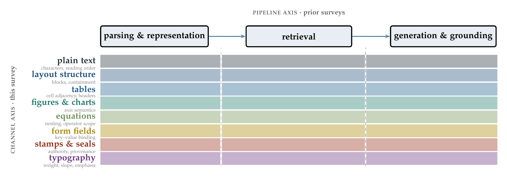
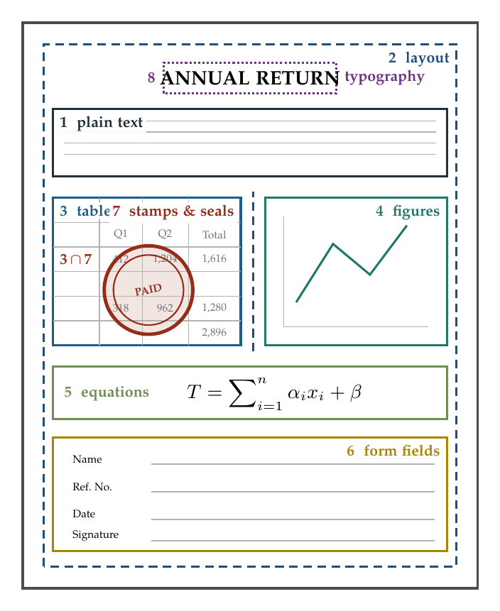
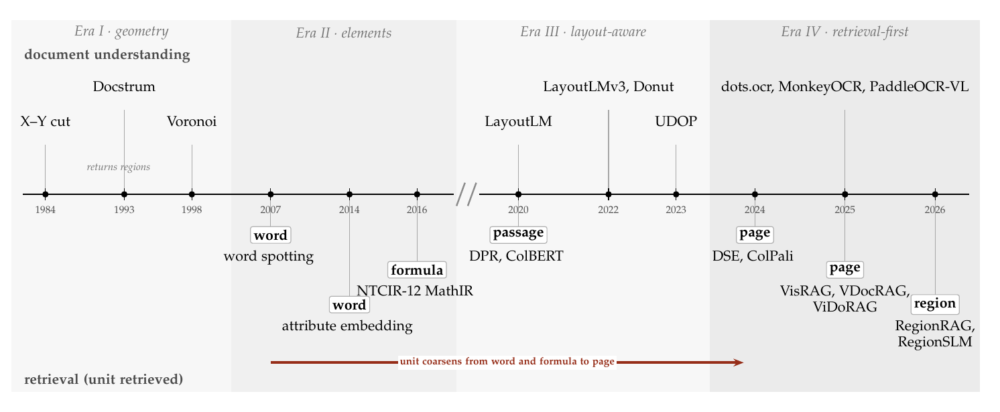

## Awesome Visual Document RAG: *Eight Channels, One Vector* [](https://awesome.re)



This is the companion repository of **Eight Channels, One Vector: A Survey of Retrieval-Augmented Generation for Visual Document Understanding**, a survey that organizes visual document retrieval by *what a page contains* rather than by pipeline stage.

*Under double-blind review at IEEE Transactions on Pattern Analysis and Machine Intelligence (TPAMI). Author names and the paper link will be added after the review.*

[](#-news) [](CONTRIBUTING.md)  

*Feel free to open a pull request or an issue if a paper is missing.* Each entry uses the format below; please add only papers with a real arXiv, DOI or proceedings link.

```
* [Venue Year] **Title** [[arXiv](link)][[DOI](link)]
```

## 🔥 News

* **2026-09** Repository released with the submission: 194 cited works, 33 methods, the channel × paradigm matrix, benchmark channel coverage, a verified result file and the 18-item reporting checklist.

📅 Literature cut-off: **31 August 2026**. Later work is added under the same criteria, with the date it was added.

## Abstract

Document collections have outgrown what any model can read at once, so retrieval now decides what a model ever sees. Since 2024, visual document retrieval has made the page image the unit of retrieval, and existing surveys organize the resulting literature by where computation happens: pipeline stage, retrieval modality or task. None asks what the page contains. We organize the field by content channel. A page carries up to eight channels at once (text, layout, tables, figures, equations, form fields, stamps and typography), and they overlap rather than partition it, as when a stamp crosses a table. Retrieval encoders pool page regions without recording which channel each came from. We formalize the resulting loss as channel interference, a second-order interaction between channels, and show that late-interaction scoring produces it even between channels that do not overlap. A channel-by-paradigm matrix over 33 methods and a channel-coverage audit of retrieval benchmarks yield three findings. Stamps and typography have never been evaluated under any retrieval paradigm, and no retrieval benchmark annotates them. Work on OCR-based pipelines reaches the same failure from the other side: accurate recognition still harms retrieval when it discards structure. Page-level metrics can register neither. We therefore propose a channel-aware retrieval score and an 18-item reporting checklist, derive open problems directly from the empty cells of the matrix, and release every table, drawn from a pool of 1,778 records across 39 venues, with source-level provenance in this repository.

## Citation

If you find this repository useful, please cite the survey (entry will be completed after review):

```bibtex
@article{eightchannels2026,
  title   = {Eight Channels, One Vector: A Survey of Retrieval-Augmented Generation for Visual Document Understanding},
  author  = {Anonymous},
  journal = {Under review at IEEE Transactions on Pattern Analysis and Machine Intelligence},
  year    = {2026}
}
```

## Menu

- [The eight channels](#the-eight-channels)
- [2026 highlights (peer-reviewed)](#2026-highlights-peer-reviewed)
- [Surveys](#surveys)
- [Methods (33)](#methods-33)
  - [Screenshot embedding (one vector per page)](#screenshot-embedding-one-vector-per-page)
  - [Late interaction (many vectors per page)](#late-interaction-many-vectors-per-page)
  - [End-to-end visual document RAG](#end-to-end-visual-document-rag)
  - [Region- and layout-level retrieval](#region--and-layout-level-retrieval)
  - [Agentic document RAG](#agentic-document-rag)
- [Historical foundations (before 2020)](#historical-foundations-before-2020)
- [Channel 1 · Plain text and reading order](#channel-1--plain-text-and-reading-order)
- [Channel 2 · Layout structure](#channel-2--layout-structure)
- [Channel 3 · Tables](#channel-3--tables)
- [Channel 4 · Figures and charts](#channel-4--figures-and-charts)
- [Channel 5 · Equations](#channel-5--equations)
- [Channel 6 · Form fields](#channel-6--form-fields)
- [Channel 7 · Stamps and seals](#channel-7--stamps-and-seals)
- [Channel 8 · Typography](#channel-8--typography)
- [Encoding, chunking, indexing and efficiency](#encoding-chunking-indexing-and-efficiency)
- [Attribution, grounding and visual-token compression](#attribution-grounding-and-visual-token-compression)
- [Does OCR still matter? Parsing, robustness, long context](#does-ocr-still-matter-parsing-robustness-long-context)
- [Datasets and benchmarks](#datasets-and-benchmarks)
- [Metrics and evaluation](#metrics-and-evaluation)
- [RAG, retrieval and review-method foundations](#rag-retrieval-and-review-method-foundations)
- [Adjacent work (out of scope)](#adjacent-work-out-of-scope)
- [Data files](#data-files)
- [Full bibliography by year](#full-bibliography-by-year)

## The eight channels



A page carries up to eight kinds of content at once, and they overlap. Retrieval encoders pool page regions without recording which channel each came from.

| # | Channel | What a pooled page vector is not required to keep |
|:-:|---|---|
| 1 | Plain text | reading order and block boundaries |
| 2 | Layout structure | containment and neighbor relations |
| 3 | Tables | cell adjacency and header scope |
| 4 | Figures and charts | the mapping from position to value |
| 5 | Equations | nesting and operator scope |
| 6 | Form fields | key–value binding |
| 7 | Stamps and seals | authority and provenance; overprinted content |
| 8 | Typography | weight, slope and emphasis |

<br clear="right"/>



*Four decades of document understanding and retrieval. The retrieved unit coarsened from words and formulas to whole pages; region-level retrieval returned only in 2026.*

## 2026 highlights (peer-reviewed)

Peer-reviewed 2026 work cited in the survey. Preprints are listed in their topic sections and marked arXiv.

* [Findings ACL 2026] **A Survey on MLLM-based Visually Rich Document Understanding: Methods, Challenges, and Emerging Trends** [[DOI](https://doi.org/10.18653/v1/2026.findings-acl.652)]
* [ACL 2026] **Are We Using the Right Benchmark: An Evaluation Framework for Visual Token Compression Methods** [[DOI](https://doi.org/10.18653/v1/2026.acl-long.195)]
* [AAAI 2026] **Benchmarking Visual LLMs Resilience to Unanswerable Questions on Visually Rich Documents** [[DOI](https://doi.org/10.1609/aaai.v40i10.37759)]
* [SIGIR 2026] **Beyond Chunk-Then-Embed: A Comprehensive Taxonomy and Evaluation of Document Chunking Strategies for Information Retrieval** [[DOI](https://doi.org/10.1145/3805712.3808575)]
* [AI Review 2026] **Deep Learning based Visually Rich Document Content Understanding: A Survey** [[arXiv](https://arxiv.org/abs/2408.01287)]
* [IP&M 2026] **Defining the Problem: The Impact of OCR Quality on Retrieval-Augmented Generation Performance and Strategies for Improvement** [[DOI](https://doi.org/10.1016/j.ipm.2025.104368)]
* [KDD 2026] **EmoRAG: Evaluating RAG Robustness to Symbolic Perturbations** [[DOI](https://doi.org/10.1145/3770854.3780238)]
* [ICLR 2026] **IndicVisionBench: A Multimodal Benchmark for Indic Languages** 
* [ACL 2026] **LAD-RAG: Layout-aware Dynamic RAG for Visually-Rich Document Understanding** [[DOI](https://doi.org/10.18653/v1/2026.acl-long.724)]
* [ACM TOIS 2026] **Large Language Models in Document Intelligence: A Comprehensive Survey, Recent Advances, Challenges and Future Trends** [[DOI](https://doi.org/10.1145/3768156)]
* [ICDAR 2026] **LMS-Retrieval: Layout-Aware, Modality-Aware, Structure-Aware Document Retrieval** [[DOI](https://doi.org/10.1007/978-3-032-36039-7_8)]
* [AAAI 2026] **Look as You Think: Unifying Reasoning and Visual Evidence Attribution for Verifiable Document RAG via Reinforcement Learning** [[DOI](https://doi.org/10.1609/aaai.v40i38.40488)]
* [ICLR 2026] **MetaEmbed: Scaling Multimodal Retrieval at Test-Time with Flexible Late Interaction** [[arXiv](https://arxiv.org/abs/2509.18095)]
* [SIGIR 2026] **QE-RAG: A Robust Retrieval-Augmented Generation Benchmark for Query Entry Errors** [[DOI](https://doi.org/10.1145/3805712.3808610)]
* [AAAI 2026] **RegionRAG: Region-level Retrieval-Augmented Generation for Visual Document Understanding** [[DOI](https://doi.org/10.1609/aaai.v40i8.37597)]
* [SIGIR 2026] **RegionSLM: Region-aware Question Answering on Document Screenshots** [[DOI](https://doi.org/10.1145/3805712.3809603)]
* [WACV 2026] **SAVIOR: Sample-efficient Adaptation of Vision-Language Models for OCR Representation** [[DOI](https://doi.org/10.1109/wacvw68408.2026.00081)]
* [ACL 2026] **Scaling Beyond Context: A Survey of Multimodal Retrieval-Augmented Generation for Document Understanding** [[arXiv](https://arxiv.org/abs/2510.15253)]
* [CVPR 2026] **SEA-Vision: A Multilingual Benchmark for Comprehensive Document and Scene Text Understanding in Southeast Asia** [[arXiv](https://arxiv.org/abs/2603.15409)]
* [ACL 2026] **SlideAgent: Hierarchical Agentic Framework for Multi-Page Visual Document Understanding** [[DOI](https://doi.org/10.18653/v1/2026.acl-long.677)]
* [Findings ACL 2026] **StruNRAG: Evaluation of OCR-Induced Structural Noise on RAG Robustness** [[DOI](https://doi.org/10.18653/v1/2026.findings-acl.955)]
* [ICDAR 2026] **TexTAR: Textual Attribute Recognition in Multi-domain and Multi-lingual Document Images** [[arXiv](https://arxiv.org/abs/2509.13151)][[DOI](https://doi.org/10.1007/978-3-032-04614-7_16)]
* [TPAMI 2026] **TextMonkey: An OCR-free Large Multimodal Model for Understanding Document** [[DOI](https://doi.org/10.1109/tpami.2026.3653415)]
* [ACL 2026] **UNIKIE-BENCH: Benchmarking Large Multimodal Models for Key Information Extraction in Visual Documents** [[DOI](https://doi.org/10.18653/v1/2026.acl-long.287)]
* [ACL 2026] **ViDoRe V3: A Comprehensive Evaluation of Retrieval Augmented Generation in Complex Real-World Scenarios** [[arXiv](https://arxiv.org/abs/2601.08620)]
* [ACL 2026] **When Good OCR Is Not Enough: Benchmarking OCR Robustness for Retrieval-Augmented Generation** [[DOI](https://doi.org/10.18653/v1/2026.acl-industry.60)]
* [ICLR 2026] **When to Use Graphs in RAG: A Comprehensive Analysis for Graph Retrieval-Augmented Generation** [[arXiv](https://arxiv.org/abs/2506.05690)]

## Surveys

Each survey is listed with the organizing axis stated in its own abstract. None organizes by what the page contains.

| Survey | Venue | Organizing axis | Link |
|---|---|---|---|
| Scaling Beyond Context: A Survey of Multimodal Retrieval-Augmented Generation for Document Understanding | ACL 2026 | domain, retrieval modality, granularity | [[arXiv](https://arxiv.org/abs/2510.15253)] |
| Unlocking Multimodal Document Intelligence: From Current Triumphs to Future Frontiers of Visual Document Retrieval | arXiv 2026 | pipeline stage | [[arXiv](https://arxiv.org/abs/2602.19961)] |
| Roles of MLLMs in Visually Rich Document Retrieval for RAG: A Survey | IJCNLP-AACL 2025 | role of the MLLM | [[arXiv](https://arxiv.org/abs/2601.03262)] |
| Large Language Models in Document Intelligence: A Comprehensive Survey, Recent Advances, Challenges and Future Trends | ACM TOIS 2026 | LLM capability | [[DOI](https://doi.org/10.1145/3768156)] |
| A Survey on MLLM-based Visually Rich Document Understanding: Methods, Challenges, and Emerging Trends | Findings ACL 2026 | task family | [[DOI](https://doi.org/10.18653/v1/2026.findings-acl.652)] |
| Deep Learning based Visually Rich Document Content Understanding: A Survey | AI Review 2026 | task family | [[arXiv](https://arxiv.org/abs/2408.01287)] |
| Multimodal Large Language Models for Text-rich Image Understanding: A Comprehensive Review | Findings ACL 2025 | task family | [[DOI](https://doi.org/10.18653/v1/2025.findings-acl.1023)] |
| Document Parsing Unveiled: Techniques, Challenges and Prospects for Structured Information Extraction | arXiv 2024 | task family | [[arXiv](https://arxiv.org/abs/2410.21169)] |
| Document Intelligence in the Era of Large Language Models: A Survey | arXiv 2025 | task family | [[arXiv](https://arxiv.org/abs/2510.13366)] |
| Visual Document Understanding: A Comparative Review of Modern Methods | CVIU 2024 | task family | [[DOI](https://doi.org/10.1007/978-3-031-93694-4_29)] |
| Ask in Any Modality: A Comprehensive Survey on Multimodal Retrieval-Augmented Generation | Findings ACL 2025 | retrieval modality | [[DOI](https://doi.org/10.18653/v1/2025.findings-acl.861)] |
| A Survey of Multimodal Retrieval-Augmented Generation | arXiv 2025 | retrieval modality | [[arXiv](https://arxiv.org/abs/2504.08748)] |
| Retrieval Augmented Generation and Understanding in Vision: A Survey and New Outlook | arXiv 2025 | retrieval modality | [[arXiv](https://arxiv.org/abs/2503.18016)] |
| Retrieval-Augmented Generation for Large Language Models: A Survey | arXiv 2023 | retrieval modality (text RAG) | [[arXiv](https://arxiv.org/abs/2312.10997)] |
| Beyond Human Annotation: Recent Advances in Data Generation Methods for Document Intelligence | arXiv 2026 | data generation | [[arXiv](https://arxiv.org/abs/2601.12318)] |
| Survey on Question Answering over Visually Rich Documents: Methods, Challenges, and Trends | arXiv 2025 | question type | [[arXiv](https://arxiv.org/abs/2501.02235)] |
| Reproducibility, Replicability, and Insights into Visual Document Retrieval with Late Interaction | SIGIR 2025 | reproducibility study (not a survey) | [[DOI](https://doi.org/10.1145/3726302.3730285)] |

## Methods (33)

*Index*: single vector, multi-vector (late interaction), hybrid or graph. *Unit*: what is returned. A dash marks a field the paper does not state in a form we could record.

### Screenshot embedding (one vector per page)

| Method | Venue | Index | Unit | Distinguishing idea | Link |
|---|---|:-:|:-:|---|---|
| **DSE** | EMNLP 2024 | single | page | rendered page as one dense vector | [[DOI](https://doi.org/10.18653/v1/2024.emnlp-main.373)] |
| **VisRAG** | ICLR 2025 | single | page | VLM embedder and reader, no parsing | [[arXiv](https://arxiv.org/abs/2410.10594)] |
| **VisRAG 2.0** | arXiv 2025 | – | page | successor with multi-image reasoning | [[arXiv](https://arxiv.org/abs/2510.09733)] |

### Late interaction (many vectors per page)

| Method | Venue | Index | Unit | Distinguishing idea | Link |
|---|---|:-:|:-:|---|---|
| **ColPali** | ICLR 2025 | multi | page | patch vectors scored by MaxSim | [[arXiv](https://arxiv.org/abs/2407.01449)] |
| **ColFlor** | MLSP 2025 | multi | page | BERT-size retriever | [[DOI](https://doi.org/10.1109/mlsp62443.2025.11204231)] |
| **ColMate** | EMNLP 2025 | multi | page | document-adapted training objective | [[DOI](https://doi.org/10.18653/v1/2025.emnlp-industry.145)] |
| **ModernVBERT** | arXiv 2025 | multi | page | compact bidirectional encoder | [[arXiv](https://arxiv.org/abs/2510.01149)] |
| **VLM2Vec-V2** | arXiv 2025 | – | page | general multimodal embedder | [[arXiv](https://arxiv.org/abs/2507.04590)] |
| **Serval** | arXiv 2025 | – | page | zero-shot, no task-specific training | [[arXiv](https://arxiv.org/abs/2509.15432)] |
| **MetaEmbed** | ICLR 2026 | multi | page | test-time choice of vector count | [[arXiv](https://arxiv.org/abs/2509.18095)] |
| **Nemotron ColEmbed V2** | arXiv 2026 | multi | page | industrial report, not peer-reviewed | [[arXiv](https://arxiv.org/abs/2602.03992)] |

### End-to-end visual document RAG

| Method | Venue | Index | Unit | Distinguishing idea | Link |
|---|---|:-:|:-:|---|---|
| **M3DocRAG** | arXiv 2024 | multi | page | multi-page, multi-document RAG | [[arXiv](https://arxiv.org/abs/2411.04952)] |
| **SV-RAG** | ICLR 2025 | – | page | adapts the reader as retriever | [[arXiv](https://arxiv.org/abs/2411.01106)] |
| **VDocRAG** | CVPR 2025 | – | page | one image format for retrieval and QA | [[DOI](https://doi.org/10.1109/cvpr52734.2025.02312)] |
| **DocAgent** | EMNLP 2025 | – | page | agentic long-context understanding | [[DOI](https://doi.org/10.18653/v1/2025.emnlp-main.893)] |
| **VisDoMRAG** | NAACL 2025 | – | page | text and visual paths made to agree | [[DOI](https://doi.org/10.18653/v1/2025.naacl-long.310)] |
| **CMRAG** | arXiv 2025 | – | page | co-modality text and pixels | [[arXiv](https://arxiv.org/abs/2509.02123)] |
| **MoLoRAG** | EMNLP 2025 | – | page | logic-aware retrieval over page relations | [[DOI](https://doi.org/10.18653/v1/2025.emnlp-main.708)] |
| **HKRAG** | arXiv 2025 | – | – | holistic knowledge construction | [[arXiv](https://arxiv.org/abs/2511.20227)] |
| **HEAVEN** | arXiv 2025 | hybrid | page | single-vector then multi-vector stage | [[arXiv](https://arxiv.org/abs/2510.22215)] |
| **HiKEY** | arXiv 2026 | – | – | hierarchical open-domain retrieval | [[arXiv](https://arxiv.org/abs/2605.29606)] |

### Region- and layout-level retrieval

| Method | Venue | Index | Unit | Distinguishing idea | Link |
|---|---|:-:|:-:|---|---|
| **VISA** | ACL 2025 | – | region | page retrieval with evidence box | [[DOI](https://doi.org/10.18653/v1/2025.acl-long.1456)] |
| **LFRAG** | arXiv 2026 | – | region | layout-oriented fine-grained retrieval | [[arXiv](https://arxiv.org/abs/2605.22829)] |
| **RegionRAG** | AAAI 2026 | – | region | indexes and returns sub-page regions | [[DOI](https://doi.org/10.1609/aaai.v40i8.37597)] |
| **RegionSLM** | SIGIR 2026 | – | region | region unit with a small reader | [[DOI](https://doi.org/10.1145/3805712.3809603)] |
| **LAD-RAG** | ACL 2026 | graph | graph | layout-aware graph retrieval | [[DOI](https://doi.org/10.18653/v1/2026.acl-long.724)] |
| **LMS-Retrieval** | ICDAR 2026 | – | region | layout-, modality-, structure-aware | [[DOI](https://doi.org/10.1007/978-3-032-36039-7_8)] |
| **ColParse** | arXiv 2026 | multi | region | parser chooses the regions to embed | [[arXiv](https://arxiv.org/abs/2603.01666)] |

### Agentic document RAG

| Method | Venue | Index | Unit | Distinguishing idea | Link |
|---|---|:-:|:-:|---|---|
| **ViDoRAG** | EMNLP 2025 | – | page | multi-agent iterative refinement | [[DOI](https://doi.org/10.18653/v1/2025.emnlp-main.464)] |
| **MDocAgent** | arXiv 2025 | – | page | text and image agents in parallel | [[arXiv](https://arxiv.org/abs/2503.13964)] |
| **SlideAgent** | ACL 2026 | – | – | hierarchical multi-page navigation | [[DOI](https://doi.org/10.18653/v1/2026.acl-long.677)] |
| **DocLens** | arXiv 2025 | – | region | tool-augmented agents on regions | [[arXiv](https://arxiv.org/abs/2511.11552)] |
| **MARDoc** | arXiv 2026 | – | – | memory-aware refinement | [[arXiv](https://arxiv.org/abs/2606.05749)] |

## Historical foundations (before 2020)

* [ICDAR-W 2019] **FUNSD: A Dataset for Form Understanding in Noisy Scanned Documents** [[DOI](https://doi.org/10.1109/icdarw.2019.10029)]
* [Pattern Recognition 2017] **A Survey of Document Image Word Spotting Techniques** [[DOI](https://doi.org/10.1016/j.patcog.2017.02.023)]
* [CS Review 2016] **Logo and Seal Based Administrative Document Image Retrieval: A Survey** [[DOI](https://doi.org/10.1016/j.cosrev.2016.09.002)]
* [SIGIR 2016] **Multi-Stage Math Formula Search: Using Appearance-Based Similarity Metrics at Scale** 
* [NTCIR 2016] **NTCIR-12 MathIR Task Overview** 
* [ICDAR 2015] **Evaluation of Deep Convolutional Nets for Document Image Classification and Retrieval** [[DOI](https://doi.org/10.1109/icdar.2015.7333910)]
* [TPAMI 2014] **Word Spotting and Recognition with Embedded Attributes** [[DOI](https://doi.org/10.1109/TPAMI.2014.2339814)]
* [NTCIR 2013] **NTCIR-10 Math Pilot Task Overview** 
* [TPAMI 2008] **Performance Evaluation and Benchmarking of Six-Page Segmentation Algorithms** [[DOI](https://doi.org/10.1109/tpami.2007.70837)]
* [IJDAR 2007] **Word Spotting for Historical Documents** 
* [IJDAR 2004] **A Survey of Table Recognition: Models, Observations, Transformations, and Inferences** 
* [IEEE TKDE 2004] **Information Retrieval in Document Image Databases** 
* [IJDAR 2000] **Mathematical Expression Recognition: A Survey** [[DOI](https://doi.org/10.1007/PL00013549)]
* [TPAMI 1998] **Optical Font Recognition Using Typographical Features** [[DOI](https://doi.org/10.1109/34.709616)]
* [CVIU 1998] **Segmentation of Page Images Using the Area Voronoi Diagram** [[DOI](https://doi.org/10.1006/cviu.1998.0684)]
* [TPAMI 1993] **The Document Spectrum for Page Layout Analysis** [[DOI](https://doi.org/10.1109/34.244677)]
* [ICPR 1984] **Hierarchical Representation of Optically Scanned Documents** 

## Channel 1 · Plain text and reading order

* [TPAMI 2026] **TextMonkey: An OCR-free Large Multimodal Model for Understanding Document** [[DOI](https://doi.org/10.1109/tpami.2026.3653415)]
* [ICCV 2025] **A Token-level Text Image Foundation Model for Document Understanding** [[arXiv](https://arxiv.org/abs/2503.02304)]
* [arXiv 2025] **dots.ocr: Multilingual Document Layout Parsing in a Single Vision-Language Model** [[arXiv](https://arxiv.org/abs/2512.02498)]
* [arXiv 2025] **MonkeyOCR: Document Parsing with a Structure-Recognition-Relation Triplet Paradigm** [[arXiv](https://arxiv.org/abs/2506.05218)]
* [arXiv 2025] **PaddleOCR-VL: Boosting Multilingual Document Parsing via a 0.9B Ultra-Compact Vision-Language Model** [[arXiv](https://arxiv.org/abs/2510.14528)]
* [ECCV 2024] **Vary: Scaling up the Vision Vocabulary for Large Vision-Language Models** [[DOI](https://doi.org/10.1007/978-3-031-73235-5_23)]
* [ICDAR 2023] **DocParser: End-to-End OCR-free Information Extraction from Visually Rich Documents** [[arXiv](https://arxiv.org/abs/2304.12484)]
* [AAAI 2023] **TrOCR: Transformer-Based Optical Character Recognition with Pre-trained Models** [[DOI](https://doi.org/10.1609/aaai.v37i11.26538)]
* [ECCV 2022] **End-to-End Document Recognition and Understanding with Dessurt** [[DOI](https://doi.org/10.1007/978-3-031-25069-9_19)]
* [ECCV 2022] **OCR-free Document Understanding Transformer** [[arXiv](https://arxiv.org/abs/2111.15664)]
* [TPAMI 2017] **An End-to-End Trainable Neural Network for Image-Based Sequence Recognition and Its Application to Scene Text Recognition** [[DOI](https://doi.org/10.1109/tpami.2016.2646371)]
* [ICDAR 2007] **An Overview of the Tesseract OCR Engine** [[DOI](https://doi.org/10.1109/icdar.2007.4376991)]

## Channel 2 · Layout structure

* [Findings ACL 2025] **A Bounding Box is Worth One Token: Interleaving Layout and Text in a Large Language Model for Document Understanding** [[DOI](https://doi.org/10.18653/v1/2025.findings-acl.379)]
* [CVPR 2025] **A Simple yet Effective Layout Token in Large Language Models for Document Understanding** [[DOI](https://doi.org/10.1109/cvpr52734.2025.01349)]
* [CVPR 2025] **DocLayLLM: An Efficient Multi-modal Extension of Large Language Models for Text-rich Document Understanding** [[DOI](https://doi.org/10.1109/cvpr52734.2025.00382)]
* [ICLR 2025] **Graph-based Document Structure Analysis** [[arXiv](https://arxiv.org/abs/2502.02501)]
* [EMNLP 2024] **DocHieNet: A Large and Diverse Dataset for Document Hierarchy Parsing** [[DOI](https://doi.org/10.18653/v1/2024.emnlp-main.65)]
* [arXiv 2024] **DocLayout-YOLO: Enhancing Document Layout Analysis through Diverse Synthetic Data and Global-to-Local Adaptive Perception** [[arXiv](https://arxiv.org/abs/2410.12628)]
* [CVPR 2023] **Unifying Vision, Text, and Layout for Universal Document Processing** [[DOI](https://doi.org/10.1109/cvpr52729.2023.01845)]
* [ACM MM 2022] **LayoutLMv3: Pre-training for Document AI with Unified Text and Image Masking** [[DOI](https://doi.org/10.1145/3503161.3548112)]
* [KDD 2020] **LayoutLM: Pre-training of Text and Layout for Document Image Understanding** [[DOI](https://doi.org/10.1145/3394486.3403172)]
* [ICDAR 2019] **PubLayNet: Largest Dataset Ever for Document Layout Analysis** [[DOI](https://doi.org/10.1109/icdar.2019.00166)]

## Channel 3 · Tables

* [NeurIPS 2025] **TabPedia: Towards Comprehensive Visual Table Understanding with Concept Synergy** [[DOI](https://doi.org/10.52202/079017-0230)]
* [ACM CSUR 2024] **Deep Learning for Table Detection and Structure Recognition: A Survey** [[DOI](https://doi.org/10.1145/3657281)]
* [ACL 2024] **Multimodal Table Understanding** [[arXiv](https://arxiv.org/abs/2406.08100)]
* [CVPR 2022] **PubTables-1M: Towards Comprehensive Table Extraction from Unstructured Documents** [[DOI](https://doi.org/10.1109/cvpr52688.2022.00459)]
* [Pattern Recognition 2022] **Table Structure Recognition and Form Parsing by End-to-End Object Detection and Relation Parsing** [[DOI](https://doi.org/10.1016/j.patcog.2022.108946)]
* [ECCV 2020] **Image-Based Table Recognition: Data, Model, and Evaluation** [[DOI](https://doi.org/10.1007/978-3-030-58589-1_34)]

## Channel 4 · Figures and charts

* [ACM MM 2025] **Chart-HQA: A Benchmark for Hypothetical Question Answering in Charts** [[DOI](https://doi.org/10.1145/3746027.3758288)]
* [ICLR 2025] **ChartMoE: Mixture of Diversely Aligned Expert Connector for Chart Understanding** [[arXiv](https://arxiv.org/abs/2409.03277)]
* [EMNLP 2025] **Unmasking Deceptive Visuals: Benchmarking Multimodal Large Language Models on Misleading Chart Question Answering** [[DOI](https://doi.org/10.18653/v1/2025.emnlp-main.695)]
* [NeurIPS 2024] **CharXiv: Charting Gaps in Realistic Chart Understanding in Multimodal LLMs** [[DOI](https://doi.org/10.52202/079017-3609)]
* [ACM MM 2024] **OneChart: Purify the Chart Structural Extraction via One Auxiliary Token** [[DOI](https://doi.org/10.1145/3664647.3681167)]
* [Findings ACL 2022] **ChartQA: A Benchmark for Question Answering about Charts with Visual and Logical Reasoning** [[DOI](https://doi.org/10.18653/v1/2022.findings-acl.177)]
* [WACV 2020] **PlotQA: Reasoning over Scientific Plots** [[DOI](https://doi.org/10.1109/wacv45572.2020.9093523)]

## Channel 5 · Equations

* [CVPR 2025] **Image Over Text: Transforming Formula Recognition Evaluation with Character Detection Matching** [[arXiv](https://arxiv.org/abs/2409.03643)]
* [FnTIR 2025] **Mathematical Information Retrieval: Search and Question Answering** [[DOI](https://doi.org/10.1561/1500000095)]
* [ICLR 2024] **Nougat: Neural Optical Understanding for Academic Documents** [[arXiv](https://arxiv.org/abs/2308.13418)]
* [arXiv 2024] **UniMERNet: A Universal Network for Real-World Mathematical Expression Recognition** [[arXiv](https://arxiv.org/abs/2404.15254)]

## Channel 6 · Form fields

* [ACL 2026] **UNIKIE-BENCH: Benchmarking Large Multimodal Models for Key Information Extraction in Visual Documents** [[DOI](https://doi.org/10.18653/v1/2026.acl-long.287)]
* [Findings ACL 2024] **LMDX: Language Model-based Document Information Extraction and Localization** [[DOI](https://doi.org/10.18653/v1/2024.findings-acl.899)]
* [NeurIPS 2024] **SRFUND: A Multi-Granularity Hierarchical Structure Reconstruction Benchmark in Form Understanding** [[DOI](https://doi.org/10.52202/079017-3571)]
* [ICCV 2023] **ICL-D3IE: In-Context Learning with Diverse Demonstrations Updating for Document Information Extraction** [[DOI](https://doi.org/10.1109/iccv51070.2023.01785)]
* [ACL 2022] **FormNet: Structural Encoding beyond Sequential Modeling in Form Document Information Extraction** [[DOI](https://doi.org/10.18653/v1/2022.acl-long.260)]

## Channel 7 · Stamps and seals

> No retrieval system evaluates on this channel. The literature is small and concerned almost entirely with detection.

* [arXiv 2025] **DKDS: A Benchmark Dataset of Degraded Kuzushiji Documents with Seals for Detection and Binarization** [[arXiv](https://arxiv.org/abs/2511.09117)]
* [ICVGIP-W 2017] **SPODS: A Dataset of Color-Official Documents and Detection of Logo, Stamp, and Signature** [[DOI](https://doi.org/10.1007/978-3-319-68124-5_19)]
* [ICDAR 2015] **Text-Graphics Separation to Detect Logo and Stamp from Color Document Images: A Spectral Approach** [[DOI](https://doi.org/10.1109/ICDAR.2015.7333826)]
* [ICDAR 2011] **Signature Segmentation from Machine Printed Documents Using Conditional Random Field** [[DOI](https://doi.org/10.1109/ICDAR.2011.236)]

## Channel 8 · Typography

> One annotated corpus exists (TexTAR). No retrieval benchmark annotates typography.

* [ICDAR 2026] **TexTAR: Textual Attribute Recognition in Multi-domain and Multi-lingual Document Images** [[arXiv](https://arxiv.org/abs/2509.13151)][[DOI](https://doi.org/10.1007/978-3-032-04614-7_16)]
* [ICDAR 2023] **Analyzing Font Style Usage and Contextual Factors in Real Images** [[DOI](https://doi.org/10.1007/978-3-031-41682-8_21)]
* [ICDAR-W 2021] **Using Robust Regression to Find Font Usage Trends** [[DOI](https://doi.org/10.1007/978-3-030-86159-9_9)]
* [ACM MM 2015] **DeepFont: Identify Your Font from an Image** [[DOI](https://doi.org/10.1145/2733373.2806219)]
* [TPAMI 2006] **Font Adaptive Word Indexing of Modern Printed Documents** [[DOI](https://doi.org/10.1109/tpami.2006.162)]

## Encoding, chunking, indexing and efficiency

* [SIGIR 2026] **Beyond Chunk-Then-Embed: A Comprehensive Taxonomy and Evaluation of Document Chunking Strategies for Information Retrieval** [[DOI](https://doi.org/10.1145/3805712.3808575)]
* [arXiv 2026] **Structural Anchor Pruning: Training-Free Multi-Vector Compression for Visual Document Retrieval** [[arXiv](https://arxiv.org/abs/2601.20107)]
* [ICLR 2026] **When to Use Graphs in RAG: A Comprehensive Analysis for Graph Retrieval-Augmented Generation** [[arXiv](https://arxiv.org/abs/2506.05690)]
* [ACL 2025] **Any Information Is Just Worth One Single Screenshot: Unifying Search with Visualized Information Retrieval** [[DOI](https://doi.org/10.18653/v1/2025.acl-long.943)]
* [AAAI 2025] **DocKylin: A Large Multimodal Model for Visual Document Understanding with Efficient Visual Slimming** [[DOI](https://doi.org/10.1609/aaai.v39i9.33076)]
* [arXiv 2025] **DocPruner: A Storage-Efficient Framework for Multi-Vector Visual Document Retrieval via Adaptive Patch-Level Embedding Pruning** [[arXiv](https://arxiv.org/abs/2509.23883)]
* [Findings NAACL 2025] **On the Effectiveness of Semantic Chunking** 
* [arXiv 2024] **Late Chunking: Contextual Chunk Embeddings Using Long-Context Embedding Models** [[arXiv](https://arxiv.org/abs/2409.04701)]

## Attribution, grounding and visual-token compression

* [ACL 2026] **Are We Using the Right Benchmark: An Evaluation Framework for Visual Token Compression Methods** [[DOI](https://doi.org/10.18653/v1/2026.acl-long.195)]
* [arXiv 2026] **CiteVQA: Benchmarking Evidence Attribution for Trustworthy Document Intelligence** [[arXiv](https://arxiv.org/abs/2605.12882)]
* [AAAI 2026] **Look as You Think: Unifying Reasoning and Visual Evidence Attribution for Verifiable Document RAG via Reinforcement Learning** [[DOI](https://doi.org/10.1609/aaai.v40i38.40488)]
* [arXiv 2025] **ARIAL: An Agentic Framework for Document VQA with Precise Answer Localization** [[arXiv](https://arxiv.org/abs/2511.18192)]
* [arXiv 2025] **DeepSeek-OCR: Contexts Optical Compression** [[arXiv](https://arxiv.org/abs/2510.18234)]
* [ICLR 2025] **Measuring and Enhancing Trustworthiness of LLMs in RAG through Grounded Attributions and Learning to Refuse** [[arXiv](https://arxiv.org/abs/2409.11242)]
* [ICLR 2025] **ReDeEP: Detecting Hallucination in Retrieval-Augmented Generation via Mechanistic Interpretability** [[arXiv](https://arxiv.org/abs/2410.11414)]
* [Findings ACL 2025] **Token Pruning in Multimodal Large Language Models: Are We Solving the Right Problem?** [[DOI](https://doi.org/10.18653/v1/2025.findings-acl.802)]

## Does OCR still matter? Parsing, robustness, long context

* [AAAI 2026] **Benchmarking Visual LLMs Resilience to Unanswerable Questions on Visually Rich Documents** [[DOI](https://doi.org/10.1609/aaai.v40i10.37759)]
* [arXiv 2026] **Can OCR-VLMs Read Devanagari? A Stress-Test Benchmark and Post-Correction Study** [[arXiv](https://arxiv.org/abs/2606.29213)]
* [IP&M 2026] **Defining the Problem: The Impact of OCR Quality on Retrieval-Augmented Generation Performance and Strategies for Improvement** [[DOI](https://doi.org/10.1016/j.ipm.2025.104368)]
* [KDD 2026] **EmoRAG: Evaluating RAG Robustness to Symbolic Perturbations** [[DOI](https://doi.org/10.1145/3770854.3780238)]
* [arXiv 2026] **ICDAR 2025 Competition on End-to-End Document Image Machine Translation Towards Complex Layouts** [[arXiv](https://arxiv.org/abs/2603.09392)]
* [SIGIR 2026] **QE-RAG: A Robust Retrieval-Augmented Generation Benchmark for Query Entry Errors** [[DOI](https://doi.org/10.1145/3805712.3808610)]
* [WACV 2026] **SAVIOR: Sample-efficient Adaptation of Vision-Language Models for OCR Representation** [[DOI](https://doi.org/10.1109/wacvw68408.2026.00081)]
* [Findings ACL 2026] **StruNRAG: Evaluation of OCR-Induced Structural Noise on RAG Robustness** [[DOI](https://doi.org/10.18653/v1/2026.findings-acl.955)]
* [ACL 2026] **When Good OCR Is Not Enough: Benchmarking OCR Robustness for Retrieval-Augmented Generation** [[DOI](https://doi.org/10.18653/v1/2026.acl-industry.60)]
* [ICDAR-W 2025] **Enhancing Document VQA Models via Retrieval-Augmented Generation** [[DOI](https://doi.org/10.1007/978-3-032-09368-4_6)]
* [arXiv 2025] **Evaluating Robustness of LLMs in Question Answering on Multilingual Noisy OCR Data** [[arXiv](https://arxiv.org/abs/2502.16781)]
* [ICDAR 2025] **IndicDLP: A Foundational Dataset for Multi-lingual and Multi-domain Document Layout Parsing** [[DOI](https://doi.org/10.1007/978-3-032-04614-7_2)]
* [DocEng 2025] **Lost in OCR Translation? Vision-Based Approaches to Robust Document Retrieval** [[arXiv](https://arxiv.org/abs/2505.05666)]
* [ICCV 2025] **OCR Hinders RAG: Evaluating the Cascading Impact of OCR on Retrieval-Augmented Generation** [[DOI](https://doi.org/10.1109/iccv51701.2025.01620)]
* [Findings ACL 2025] **READoc: A Unified Benchmark for Realistic Document Structured Extraction** [[DOI](https://doi.org/10.18653/v1/2025.findings-acl.1128)]
* [IJDAR 2025] **Scene Text Recognition: An Indic Perspective** [[DOI](https://doi.org/10.1007/s10032-024-00489-4)]
* [TPAMI 2025] **Understand Layout and Translate Text: Unified Feature-Conductive End-to-End Document Image Translation** [[DOI](https://doi.org/10.1109/tpami.2025.3530998)]

## Datasets and benchmarks

See [`data/datasets.md`](data/datasets.md) for channel coverage of every benchmark.

* [ICLR 2026] **IndicVisionBench: A Multimodal Benchmark for Indic Languages** 
* [arXiv 2026] **irpapers: A Visual Document Benchmark for Scientific Retrieval and Question Answering** [[arXiv](https://arxiv.org/abs/2602.17687)]
* [CVPR 2026] **SEA-Vision: A Multilingual Benchmark for Comprehensive Document and Scene Text Understanding in Southeast Asia** [[arXiv](https://arxiv.org/abs/2603.15409)]
* [ACL 2026] **ViDoRe V3: A Comprehensive Evaluation of Retrieval Augmented Generation in Complex Real-World Scenarios** [[arXiv](https://arxiv.org/abs/2601.08620)]
* [arXiv 2025] **BBox-DocVQA: A Large-Scale Bounding-Box Grounded Dataset for Enhancing Reasoning in Document Visual Question Answering** [[arXiv](https://arxiv.org/abs/2511.15090)]
* [NeurIPS 2025] **Benchmarking Retrieval-Augmented Multimodal Generation for Document Question Answering** [[arXiv](https://arxiv.org/abs/2505.16470)]
* [arXiv 2025] **MIRACL-VISION: A Large, Multilingual, Visual Document Retrieval Benchmark** [[arXiv](https://arxiv.org/abs/2505.11651)]
* [EMNLP 2025] **MMDocIR: Benchmarking Multimodal Retrieval for Long Documents** [[DOI](https://doi.org/10.18653/v1/2025.emnlp-main.1576)]
* [Findings ACL 2025] **MTVQA: Benchmarking Multilingual Text-Centric Visual Question Answering** [[arXiv](https://arxiv.org/abs/2405.11985)]
* [CVPR 2025] **OmniDocBench: Benchmarking Diverse PDF Document Parsing with Comprehensive Annotations** [[DOI](https://doi.org/10.1109/CVPR52734.2025.02313)]
* [arXiv 2025] **UniDoc-Bench: A Unified Benchmark for Document-Centric Multimodal RAG** [[arXiv](https://arxiv.org/abs/2510.03663)]
* [arXiv 2025] **ViDoRe Benchmark v2: Raising the Bar for Visual Retrieval** [[arXiv](https://arxiv.org/abs/2505.17166)]
* [arXiv 2025] **VisR-Bench: An Empirical Study on Visual Retrieval-Augmented Generation for Multilingual Long Document Understanding** [[arXiv](https://arxiv.org/abs/2508.07493)]
* [arXiv 2024] **LongDocURL: A Comprehensive Multimodal Long Document Benchmark Integrating Understanding, Reasoning and Locating** [[arXiv](https://arxiv.org/abs/2412.18424)]
* [NeurIPS 2024] **MMLongBench-Doc: Benchmarking Long-context Document Understanding with Visualizations** [[DOI](https://doi.org/10.52202/079017-3041)]
* [NeurIPS 2024] **SPIQA: A Dataset for Multimodal Question Answering on Scientific Papers** [[DOI](https://doi.org/10.52202/079017-3773)]
* [NeurIPS 2024] **UDA: A Benchmark Suite for Retrieval Augmented Generation in Real-World Document Analysis** [[DOI](https://doi.org/10.52202/079017-2145)]
* [ICCV 2023] **Document Understanding Dataset and Evaluation (DUDE)** [[DOI](https://doi.org/10.1109/iccv51070.2023.01789)]
* [WACV 2022] **InfographicVQA** [[DOI](https://doi.org/10.1109/wacv51458.2022.00264)]
* [ACM MM 2022] **Towards Complex Document Understanding by Discrete Reasoning** [[DOI](https://doi.org/10.1145/3503161.3548422)]
* [WACV 2021] **DocVQA: A Dataset for VQA on Document Images** [[DOI](https://doi.org/10.1109/WACV48630.2021.00225)]
* [AAAI 2021] **VisualMRC: Machine Reading Comprehension on Document Images** [[DOI](https://doi.org/10.1609/aaai.v35i15.17635)]

## Metrics and evaluation


*ViDoRe v3, best retriever in the release: nDCG@10 by content type of the evidence (values from the benchmark paper).*

* [arXiv 2025] **Are We on the Right Way for Assessing Document Retrieval-Augmented Generation?** [[arXiv](https://arxiv.org/abs/2508.03644)]
* [arXiv 2025] **RAG-Check: Evaluating Multimodal Retrieval Augmented Generation Performance** [[arXiv](https://arxiv.org/abs/2501.03995)]
* [SIGIR 2024] **Evaluating Retrieval Quality in Retrieval-Augmented Generation** [[DOI](https://doi.org/10.1145/3626772.3657957)]
* [SIGIR 2024] **The Power of Noise: Redefining Retrieval for RAG Systems** [[DOI](https://doi.org/10.1145/3626772.3657834)]

## RAG, retrieval and review-method foundations

* [SIGIR 2025] **Long Context vs. RAG: Strategies for Processing Long Documents in LLMs** [[DOI](https://doi.org/10.1145/3726302.3731690)]
* [ICLR 2025] **Long-Context LLMs Meet RAG: Overcoming Challenges for Long Inputs in RAG** [[arXiv](https://arxiv.org/abs/2410.05983)]
* [Findings EMNLP 2025] **More Documents, Same Length: Isolating the Challenge of Multiple Documents in RAG** [[DOI](https://doi.org/10.18653/v1/2025.findings-emnlp.1064)]
* [arXiv 2025] **VRD-IU: Lessons from Visually Rich Document Intelligence and Understanding** [[arXiv](https://arxiv.org/abs/2506.01388)]
* [TACL 2024] **Lost in the Middle: How Language Models Use Long Contexts** [[DOI](https://doi.org/10.1162/tacl_a_00638)]
* [arXiv 2021] **ColBERTv2: Effective and Efficient Retrieval via Lightweight Late Interaction** [[arXiv](https://arxiv.org/abs/2112.01488)]
* [BMJ 2021] **The PRISMA 2020 Statement: An Updated Guideline for Reporting Systematic Reviews** [[DOI](https://doi.org/10.1136/bmj.n71)]
* [SIGIR 2020] **ColBERT: Efficient and Effective Passage Search via Contextualized Late Interaction over BERT** [[arXiv](https://arxiv.org/abs/2004.12832)]
* [EMNLP 2020] **Dense Passage Retrieval for Open-Domain Question Answering** [[DOI](https://doi.org/10.18653/v1/2020.emnlp-main.550)]
* [NeurIPS 2020] **Retrieval-Augmented Generation for Knowledge-Intensive NLP Tasks** [[arXiv](https://arxiv.org/abs/2005.11401)]
* [ICCV 2019] **Scene Text Visual Question Answering** [[arXiv](https://arxiv.org/abs/1905.13648)]
* [FnTIR 2009] **The Probabilistic Relevance Framework: BM25 and Beyond** [[DOI](https://doi.org/10.1561/1500000019)]
* [ACM TOIS 2002] **Cumulated Gain-Based Evaluation of IR Techniques** 

## Adjacent work (out of scope)

Knowledge-based visual question answering retrieves encyclopedic text about entities in natural images. Its corpus carries none of the eight channels, so the survey treats it as adjacent.

* [CVPRW 2024] **Wiki-LLaVA: Hierarchical Retrieval-Augmented Generation for Multimodal LLMs** [[DOI](https://doi.org/10.1109/cvprw63382.2024.00188)]
* [Findings EMNLP 2024] **EchoSight: Advancing Visual-Language Models with Wiki Knowledge** [[DOI](https://doi.org/10.18653/v1/2024.findings-emnlp.83)]

## Data files

* [`data/datasets.md`](data/datasets.md) — channel coverage of 22 benchmarks and datasets (Table 6)
* [`data/matrix.md`](data/matrix.md) — channel × paradigm matrix (Table 5)
* [`data/methods.md`](data/methods.md) — the 33 methods (Table 4)
* [`data/surveys.md`](data/surveys.md) — existing surveys and their axes (Table 1)
* [`data/encoding.md`](data/encoding.md) — what encoder families preserve and lose (Table 3)
* [`data/notation.md`](data/notation.md) — notation (Table 2)
* [`data/checklist.md`](data/checklist.md) — 18-item reporting checklist, copyable (Table 7)
* [`data/results_record.csv`](data/results_record.csv) — result file: one row per (method, benchmark, metric, value) with its source
* [`data/venues.md`](data/venues.md) — per-venue screening counts
* [`data/bibliography.md`](data/bibliography.md) — all 194 references, by year
* [`data/references.bib`](data/references.bib) — BibTeX of all references

## Full bibliography by year

All 194 references of the survey, newest first: [`data/bibliography.md`](data/bibliography.md).

| Year | 2026 | 2025 | 2024 | 2023 | 2022 | 2021 | 2020 | 2019 | 2017 | 2016 | 2015 | 2014 | 2013 | 2011 | 2009 | 2008 | 2007 | 2006 | 2004 | 2002 | 2000 | 1998 | 1993 | 1984 |
|---|:-:|:-:|:-:|:-:|:-:|:-:|:-:|:-:|:-:|:-:|:-:|:-:|:-:|:-:|:-:|:-:|:-:|:-:|:-:|:-:|:-:|:-:|:-:|:-:|
| Papers | 39 | 75 | 25 | 7 | 9 | 5 | 6 | 3 | 3 | 3 | 3 | 1 | 1 | 1 | 1 | 1 | 2 | 1 | 2 | 1 | 1 | 2 | 1 | 1 |

## License

The lists and data files are released under [CC BY 4.0](LICENSE).
