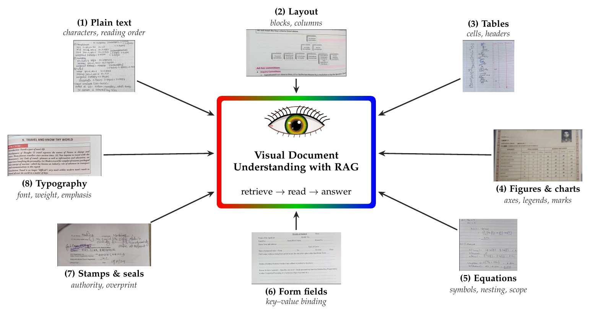
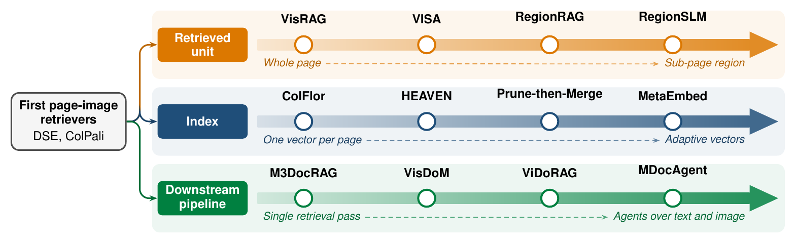
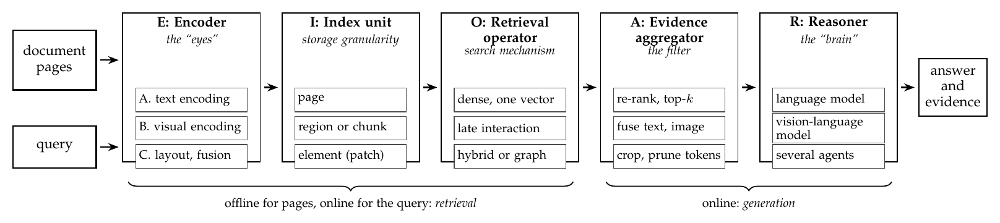
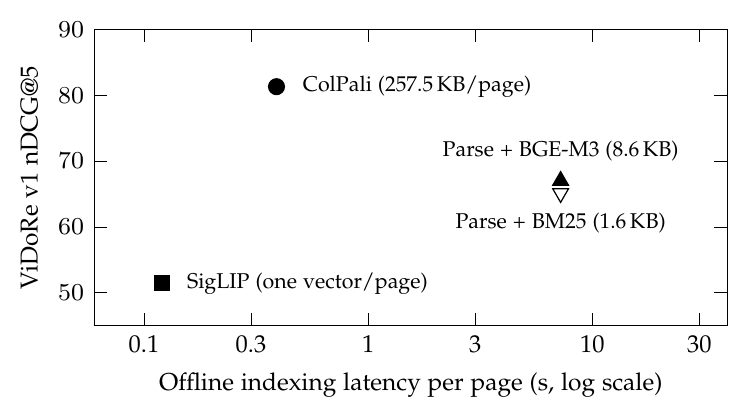

## Awesome Visual Document RAG [](https://awesome.re)



This is the repository of **Channel-wise Retrieval-Augmented Generation for Visual Document Understanding: A Survey**, a systematic survey of retrieval-augmented generation over document pages, organized by the eight kinds of content a page carries (text, layout, tables, figures, equations, form fields, stamps and typography). For details, please refer to:

**Channel-wise Retrieval-Augmented Generation for Visual Document Understanding: A Survey** [[Paper](https://anonymous.4open.science/r/VDU-RAG-Survey-E1D6/)]

*Under review at IEEE Transactions on Pattern Analysis and Machine Intelligence (TPAMI).* Authors: TBD.

[](#) [](http://makeapullrequest.com)

*Feel free to open a pull request or an issue if a related paper is missing.* The process to submit a pull request is as follows:
- a. Fork the project into your own repository.
- b. Add the Title, Paper link, Venue and Code/Project link in `README.md` using the following format:
```
|[Title](Paper Link)|Venue Year|[Code/Project](Code/Project link)|
```
- c. Submit the pull request to this branch.

## 🔥 News

📅 Last update on 26/09/2026 (literature cut-off: **24 September 2026**). Review window: 2025-2026, plus the latest edition of biennial venues.

Newly added to the survey from the 2025-2026 venue lists:

#### New in Screenshot Embedding
* [ACL 2025] Any Information Is Just Worth One Single Screenshot: Unifying Search with Visualized Information Retrieval [[Paper](https://aclanthology.org/2025.acl-long.943/)]
* [WACV 2025] GlobalDoc: A Cross-Modal Vision-Language Framework for Real-World Document Image Retrieval and Classification [[Paper](https://openaccess.thecvf.com/content/WACV2025/html/Bakkali_GlobalDoc_A_Cross-Modal_Vision-Language_Framework_for_Real-World_Document_Image_Retrieval_WACV_2025_paper.html)]

#### New in Late Interaction
* [CVPR 2026] Evo-Retriever: LLM-Guided Curriculum Evolution with Viewpoint-Pathway Collaboration for Multimodal Document Retrieval [[Paper](https://openaccess.thecvf.com/content/CVPR2026/html/Li_Evo-Retriever_LLM-Guided_Curriculum_Evolution_with_Viewpoint-Pathway_Collaboration_for_Multimodal_Document_CVPR_2026_paper.html)]
* [SIGIR 2026] Attention Grounded Enhancement for Visual Document Retrieval [[Paper](https://doi.org/10.1145/3805712.3809532)][[Code](https://github.com/VickiCui/AGREE)]
* [SIGIR 2026] ReAlign: Optimizing the Visual Document Retriever with Reasoning-Guided Fine-Grained Alignment [[Paper](https://doi.org/10.1145/3805712.3809602)][[Code](https://github.com/NEUIR/ReAlign)]
* [EMNLP 2025] LILaC: Late Interacting in Layered Component Graph for Open-domain Multimodal Multihop Retrieval [[Paper](https://aclanthology.org/2025.emnlp-main.1037/)][[Code](https://github.com/joohyung00/lilac)]
* [ICML 2025] POQD: Performance-Oriented Query Decomposer for Multi-vector retrieval [[Paper](https://proceedings.mlr.press/v267/liu25ag.html)][[Code](https://github.com/PKU-SDS-lab/POQD-ICML25)]

#### New in Index Compression and Efficiency
* [ACL 2026] Sculpting the Vector Space: Towards Efficient Multi-Vector Visual Document Retrieval via Prune-then-Merge Framework [[Paper](https://aclanthology.org/2026.findings-acl.1247/)]
* [ECCV 2026] LightSTAR: Efficient Visual Document Retrieval via Lightweight Selection with Vision-Adaptive Refinement [[Paper](https://eccv.ecva.net/virtual/2026/poster/4839)][[Code](https://github.com/bokufa/LightSTAR)]
* [SIGIR 2026] Visual RAG at Scale: Tile-Level Spatial Pooling for Efficient Multi-Vector Document Retrieval [[Paper](https://doi.org/10.1145/3805712.3808383)]
* [ECCV 2026] Unbalanced Optimal Transport for Efficient Visual Document Retrieval [[Paper](https://eccv.ecva.net/virtual/2026/poster/4715)][[Code](https://github.com/shhhhhyy/Unbalanced-Optimal-Transport-for-EVDR)]
* [SIGIR 2026] Multi-Vector Index Compression in Any Modality [[Paper](https://doi.org/10.1145/3805712.3809589)][[Code](https://github.com/hanxiangqin/omni-col-press)]
* [ACL 2025] Towards Storage-Efficient Visual Document Retrieval: An Empirical Study on Reducing Patch-Level Embeddings [[Paper](https://aclanthology.org/2025.findings-acl.1003/)]

#### New in End-to-end Visual RAG
* [AAAI 2026] URaG: Unified Retrieval and Generation in Multimodal LLMs for Efficient Long Document Understanding [[Paper](https://ojs.aaai.org/index.php/AAAI/article/view/39729)][[Code](https://github.com/shi-yx/URaG)]
* [CVPR 2026] RobustVisRAG: Causality-Aware Vision-Based Retrieval-Augmented Generation under Visual Degradations [[Paper](https://openaccess.thecvf.com/content/CVPR2026/html/Chen_RobustVisRAG_Causality-Aware_Vision-Based_Retrieval-Augmented_Generation_under_Visual_Degradations_CVPR_2026_paper.html)][[Code](https://robustvisrag.github.io/)]
* [ECCV 2026] MG2-RAG: Multi-Granularity Graph for Multimodal Retrieval-Augmented Generation [[Paper](https://eccv.ecva.net/virtual/2026/poster/3411)][[Code](https://github.com/Daboolu/MG2-RAG)]
* [CVPR 2026] M3DocDep: Multi-modal, Multi-page, Multi-document Dependency Chunking with Large Vision-Language Models [[Paper](https://openaccess.thecvf.com/content/CVPR2026/html/Shin_M3DocDep_Multi-modal_Multi-page_Multi-document_Dependency_Chunking_with_Large_Vision-Language_Models_CVPR_2026_paper.html)]
* [KDD 2026] Multi-Modal Hierarchical Retrieval-Augmented Generation for Document Question Answering [[Paper](https://doi.org/10.1145/3770855.3819034)]
* [SIGIR 2026] Towards Mixed-Modal Retrieval for Universal Retrieval-Augmented Generation [[Paper](https://doi.org/10.1145/3805712.3809716)][[Code](https://github.com/SnowNation101/Nyx)]
* [NeurIPS 2025] VRAG-RL: Empower Vision-Perception-Based RAG for Visually Rich Information Understanding via Iterative Reasoning with Reinforcement Learning [[Paper](https://openreview.net/forum?id=EeAHhNwXPV)][[Code](https://github.com/Alibaba-NLP/VRAG)]
* [ICML 2025] Retrieval-Augmented Perception: High-resolution Image Perception Meets Visual RAG [[Paper](https://proceedings.mlr.press/v267/wang25at.html)][[Code](https://github.com/DreamMr/RAP)]
* [EMNLP 2025] SimpleDoc: Multi‐Modal Document Understanding with Dual‐Cue Page Retrieval and Iterative Refinement [[Paper](https://aclanthology.org/2025.emnlp-main.1443/)][[Code](https://github.com/ag2ai/SimpleDoc)]
* [ACL 2025] NeuSym-RAG: Hybrid Neural Symbolic Retrieval with Multiview Structuring for PDF Question Answering [[Paper](https://aclanthology.org/2025.acl-long.311/)]
* [ACL 2025] Doc-React: Multi-page Heterogeneous Document Question-answering [[Paper](https://aclanthology.org/2025.acl-short.6/)]

#### New in Region Layout and Evidence Level
* [EACL 2026] SCAN: Semantic Document Layout Analysis for Textual and Visual Retrieval-Augmented Generation [[Paper](https://aclanthology.org/2026.findings-eacl.82/)]
* [AAAI 2026] Look as You Think: Unifying Reasoning and Visual Evidence Attribution for Verifiable Document RAG via Reinforcement Learning [[Paper](https://ojs.aaai.org/index.php/AAAI/article/view/40488)]
* [SIGIR 2026] Chain of Evidence: Pixel-Level Visual Attribution for Iterative Retrieval-Augmented Generation [[Paper](https://doi.org/10.1145/3805712.3809540)][[Code](https://github.com/PeiYangLiu/CoE)]
* [SIGIR 2026] Purifying Multimodal Retrieval: Fragment-Level Evidence Selection for RAG [[Paper](https://doi.org/10.1145/3805712.3809692)]
* [SIGIR 2026] MEG-RAG: Quantifying Multi-modal Evidence Grounding for Evidence Selection in RAG [[Paper](https://doi.org/10.1145/3805712.3809947)][[Code](https://anonymous.4open.science/r/anonym-9QM02BD/README.md)]
* [SIGIR 2026] Good Ranks Follow Good Answers: Unsupervised Answer-Driven Reranking for Multimodal Document QA [[Paper](https://doi.org/10.1145/3805712.3809664)]
* [ACL 2026] Utility-Oriented Visual Evidence Selection for Multimodal Retrieval-Augmented Generation [[Paper](https://aclanthology.org/2026.acl-long.1620/)][[Code](https://github.com/Hcnaeg/utility-mrag)]
* [EACL 2026] SCoPE VLM: Selective Context Processing for Efficient Document Navigation in Vision-Language Models [[Paper](https://aclanthology.org/2026.eacl-long.6/)]

#### New in Agentic RAG
* [ECCV 2026] MMAgent-R2: Learning to Rerank and Reject for Agentic mRAG [[Paper](https://eccv.ecva.net/virtual/2026/poster/4250)]
* [CVPR 2026 Findings] MARS-RL: Enhancing Multi-Agent RAG Systems for Multi-Modal Documents via Strategic Reasoning with Reinforcement Learning [[Paper](https://openaccess.thecvf.com/content/CVPR2026F/html/Wang_MARS-RL_Enhancing_Multi-Agent_RAG_Systems_for_Multi-Modal_Documents_via_Strategic_CVPRF_2026_paper.html)]
* [CVPR 2026] Resolving Evidence Sparsity: Agentic Context Engineering for Long-Document Understanding [[Paper](https://openaccess.thecvf.com/content/CVPR2026/html/Liu_Resolving_Evidence_Sparsity_Agentic_Context_Engineering_for_Long-Document_Understanding_CVPR_2026_paper.html)]
* [ACL 2026] TRACE: Traversal Retrieval-Augmented Chain of Evidence for Document Understanding [[Paper](https://aclanthology.org/2026.acl-long.445/)][[Code](https://github.com/shimurenhlq/TRACE)]
* [ACL 2026] ALDEN: Reinforcement Learning for Active Navigation and Evidence Gathering in Long Documents [[Paper](https://aclanthology.org/2026.acl-long.611/)]
* [ACL 2026] MDocRAG-RL: Empowering Multi-Modal Document RAG via Complex Visual Reasoning with Reinforcement Learning [[Paper](https://aclanthology.org/2026.findings-acl.420/)]
* [ACL 2026] MM-Doc-R1: Training Agents for Long Document Visual Question Answering through Multi-turn Reinforcement Learning [[Paper](https://aclanthology.org/2026.findings-acl.1488/)]
* [ACL 2026] Doc-V*: Coarse-to-Fine Interactive Visual Reasoning for Multi-Page Document VQA [[Paper](https://aclanthology.org/2026.acl-long.2129/)][[Code](https://github.com/SeerRay-Lab/Doc-V)]

## Abstract

A reader who opens an invoice, a contract or a lab report does not read characters alone: the total is the total because of its column, the clause binds because of the seal beside it, and the curve means something because of its axis. Retrieval-augmented generation (RAG) now answers questions over large collections of such pages, and since 2024 its retrievers have begun to treat each page as an image. Yet a page is not one thing. It carries up to eight kinds of content at once, namely text, layout, tables, figures, equations, form fields, stamps and typography, which we call *channels*. Existing surveys organize the field by pipeline stage, modality or task, and none asks what the page contains. This survey reviews retrieval-augmented generation for visual document understanding channel by channel. We screen every paper of 42 venue-year lists from 2025 and 2026 (78,352 records) and catalog 73 methods and 61 benchmarks. We (1) formalize *channel interference*, which late interaction produces even between channels that never touch; (2) trace the field along three axes: the retrieved unit, the index and the pipeline; (3) place every system in one compositional EIOAR frame (encoder, index unit, retrieval operator, evidence aggregator, reasoner); (4) show with a channel-by-paradigm matrix and a benchmark audit that stamps and typography are studied every year, yet no retrieval method is tested on them and no benchmark labels them; (5) show from the scores each paper reports that the reader, not the retriever, dominates end-to-end results; and (6) propose a channel-aware score, an 18-item reporting checklist and open problems drawn from the empty cells. All lists, tables and scripts are available at [https://anonymous.4open.science/r/VDU-RAG-Survey-E1D6/](https://anonymous.4open.science/r/VDU-RAG-Survey-E1D6/).

## Citation

If you find this survey or the paper lists useful, please consider citing:

```bibtex
@article{vdurag2026survey,
  title   = {Channel-wise Retrieval-Augmented Generation for Visual Document Understanding: A Survey},
  author  = {TBD},
  journal = {Under review at IEEE Transactions on Pattern Analysis and Machine Intelligence},
  year    = {2026}
}
```

## Overview





**Review protocol.** 42 venue-year lists were screened in full (78,352 records); 2,014 related records were kept after title/abstract screening, 2,008 were assessed against the inclusion criteria, and 134 works are cataloged (73 methods, 61 benchmarks).

## Menu

- [The Eight Channels](#the-eight-channels)
- [Datasets](#datasets)
  - [Channel-audited Benchmarks](#channel-audited-benchmarks)
    - [Retrieval and RAG Benchmarks](#retrieval-and-rag-benchmarks)
    - [Document QA Benchmarks](#document-qa-benchmarks)
    - [Channel-specific Datasets](#channel-specific-datasets)
  - [Benchmarks Released at 2025-2026 Venues](#benchmarks-released-at-2025-2026-venues)
    - [Retrieval and RAG](#retrieval-and-rag)
    - [Long-document QA and Reasoning](#long-document-qa-and-reasoning)
    - [Grounding Parsing and OCR](#grounding-parsing-and-ocr)
    - [Multilingual and Indic](#multilingual-and-indic)
- [Visual Document RAG Methods](#visual-document-rag-methods)
  - [Screenshot Embedding](#screenshot-embedding)
  - [Late Interaction](#late-interaction)
  - [Index Compression and Efficiency](#index-compression-and-efficiency)
  - [End-to-end Visual RAG](#end-to-end-visual-rag)
  - [Region Layout and Evidence Level](#region-layout-and-evidence-level)
  - [Agentic RAG](#agentic-rag)
- [Metrics and Reported Scores](#metrics-and-reported-scores)
- [Venues](#venues)
- [Further Reading](#further-reading)
- [Data Files and Scripts](#data-files-and-scripts)

## The Eight Channels

|Channel|OCR → LLM|MLLM-native|Text RAG|Visual RAG|Details|
|---|:-:|:-:|:-:|:-:|:-:|
|**Plain text**|✓|✓|✓|✓|[Page](pages/channels/plain-text.md)|
|**Layout**|✓|✓|✓|✓|[Page](pages/channels/layout-structure.md)|
|**Tables**|✓|✓|✓|✓|[Page](pages/channels/tables.md)|
|**Figures and charts**|✓|✓|✓|✓|[Page](pages/channels/figures-and-charts.md)|
|**Equations**|✓|✓|✓|○|[Page](pages/channels/equations.md)|
|**Form fields**|✓|✓|✓|✓|[Page](pages/channels/form-fields.md)|
|**Stamps and seals**|✗|✗|✗|✗|[Page](pages/channels/stamps-and-seals.md)|
|**Typography**|✗|✗|✗|✗|[Page](pages/channels/typography.md)|

✓ results reported; ○ established task, but no method of that paradigm reports on it; ✗ nothing reported (paper Table 7).

## Datasets

### Channel-audited Benchmarks

Channel coverage of each benchmark is in [pages/datasets.md](pages/datasets.md) (paper Table 8).

#### Retrieval and RAG Benchmarks

|Dataset|Venue|Year|Size|Queries|Language|Channels annotated|Evaluation Metric|Project|
|---|:-:|:-:|:-:|:-:|:-:|---|:-:|:-:|
|[ViDoRe v1](https://openreview.net/forum?id=ogjBpZ8uSi)|ICLR|2025|-|-|EN, FR|Txt|nDCG@5|[Project](https://huggingface.co/collections/vidore/vidore-benchmark)|
|[ViDoRe v2](https://arxiv.org/abs/2505.17166)|arXiv|2025|-|-|multi|Txt|-|[Project](https://huggingface.co/collections/vidore/vidore-benchmark-v2)|
|[ViDoRe v3](https://aclanthology.org/2026.acl-long.755/)|ACL|2026|-|-|6 langs|Txt, Lay, Tab, Fig|-|[Project](https://huggingface.co/collections/vidore/vidore-benchmark-v3)|
|[MMDocIR](https://aclanthology.org/2025.emnlp-main.1576/)|EMNLP|2025|-|-|EN|Txt, Lay, Tab, Fig|-|[Project](https://huggingface.co/MMDocIR)|
|[MMDocRAG](https://scholar.google.com/scholar?q=Benchmarking+Retrieval-Augmented+Multimodal+Generation+for+Document+Question+Answering)|NeurIPS|2025|-|-|EN|Txt, Tab, Fig|-|[Project](https://github.com/MMDocRAG/MMDocRAG)|
|[M3DocVQA](https://openaccess.thecvf.com/content/ICCV2025W/Findings/html/Cho_M3DocVQA_Multi-modal_Multi-page_Multi-document_Understanding_ICCVW_2025_paper.html)|ICCVW|2025|40K+ pages|-|EN|Txt, Fig|-|[Project](https://github.com/bloomberg/m3docrag)|
|[ViDoSeek](https://aclanthology.org/2025.emnlp-main.464/)|EMNLP|2025|-|-|EN|Txt|-|[Project](https://github.com/Alibaba-NLP/ViDoRAG)|
|[UniDoc-Bench](https://arxiv.org/abs/2510.03663)|arXiv|2025|70K pages|-|EN|Txt, Lay, Tab|-|[Project](https://github.com/SalesforceAIResearch/UniDOC-Bench)|
|[SciEGQA](https://yuwenhan07.github.io/SciEGQA-project/)|arXiv|2026|-|1,623 + 30K|EN|Txt, Lay|-|[Project](https://yuwenhan07.github.io/SciEGQA-project/)|

#### Document QA Benchmarks

|Dataset|Venue|Year|Size|Queries|Language|Channels annotated|Evaluation Metric|Project|
|---|:-:|:-:|:-:|:-:|:-:|---|:-:|:-:|
|[DocVQA](https://doi.org/10.1109/WACV48630.2021.00225)|WACV|2021|12,767 images|50,000|EN|Txt|ANLS|[Project](https://www.docvqa.org)|
|[InfographicVQA](https://scholar.google.com/scholar?q=InfographicVQA)|WACV|2022|5,485 images|30,035|EN|Txt, Lay, Fig|ANLS|[Project](https://www.docvqa.org)|
|[ChartQA](https://scholar.google.com/scholar?q=ChartQA%3A+A+Benchmark+for+Question+Answering+about+Charts+with+Visual+and+Logical+Reasoning)|ACL Find.|2022|20,882 charts|32,719|EN|Fig|relaxed acc.|[Project](https://github.com/vis-nlp/ChartQA)|
|[TAT-DQA](https://scholar.google.com/scholar?q=Towards+Complex+Document+Understanding+by+Discrete+Reasoning)|ACM MM|2022|2,758 docs|16,558|EN|Txt, Tab|EM, F1|[Project](https://github.com/NExTplusplus/TAT-DQA)|
|[SPIQA](https://scholar.google.com/scholar?q=SPIQA%3A+A+Dataset+for+Multimodal+Question+Answering+on+Scientific+Papers)|NeurIPS|2024|-|270K|EN|Txt, Tab, Fig|-|[Project](https://huggingface.co/datasets/google/spiqa)|
|[LongDocURL](https://aclanthology.org/2025.acl-long.57/)|ACL|2025|396 docs|2,325|EN|Txt, Lay, Tab, Fig|-|[Project](https://github.com/dengc2023/LongDocURL)|
|[MTVQA](https://aclanthology.org/2025.findings-acl.404/)|ACL Find.|2025|-|-|9 langs|Txt|-|[Project](https://github.com/bytedance/MTVQA)|

#### Channel-specific Datasets

|Dataset|Venue|Year|Size|Queries|Language|Channels annotated|Evaluation Metric|Project|
|---|:-:|:-:|:-:|:-:|:-:|---|:-:|:-:|
|[FUNSD](https://scholar.google.com/scholar?q=FUNSD%3A+A+Dataset+for+Form+Understanding+in+Noisy+Scanned+Documents)|ICDARW|2019|199 forms|-|EN|Txt, Frm|F1|[Project](https://guillaumejaume.github.io/FUNSD/)|
|[VRDU](https://doi.org/10.1145/3580305.3599929)|KDD|2023|-|-|EN|Txt, Frm|-|[Project](https://github.com/google-research-datasets/vrdu)|
|[DocLayNet](https://doi.org/10.1145/3534678.3539043)|KDD|2022|80,863 pages|-|EN|Txt, Lay, Tab, Fig, Eqn|mAP|[Project](https://github.com/DS4SD/DocLayNet)|
|[PubTables-1M](https://scholar.google.com/scholar?q=PubTables-1M%3A+Towards+Comprehensive+Table+Extraction+from+Unstructured+Documents)|CVPR|2022|-|-|EN|Tab|GriTS|[Project](https://github.com/microsoft/table-transformer)|
|[UniMER](https://openaccess.thecvf.com/content/CVPR2026/html/Gu_UniMERNet_A_Universal_Network_for_Real-World_Mathematical_Expression_Recognition_CVPR_2026_paper.html)|CVPR|2026|-|-|-|Eqn|-|[Project](https://github.com/opendatalab/UniMERNet)|
|[SPODS](https://doi.org/10.1007/978-3-319-68124-5_19)|ICVGIP-W|2017|-|-|-|Stp|-|[Project](https://facweb.iitkgp.ac.in/~jay/spods/index.html)|
|[ReST](https://arxiv.org/pdf/2304.11966)|ICDAR|2023|-|-|ZH|Stp|-|-|
|[DKDS](https://doi.org/10.1007/s10032-026-00595-5)|IJDAR|2026|-|-|JA|Stp|-|[Project](https://github.com/RuiyangJu/DKDS)|
|[TexTAR](https://doi.org/10.1007/978-3-032-04614-7_16)|ICDAR|2025|-|-|multi|Txt, Typ|-|[Project](https://github.com/tex-tar/tex-tar)|

### Benchmarks Released at 2025-2026 Venues

#### Retrieval and RAG

|Dataset|Published in|Focus|Project|
|---|:-:|---|:-:|
|[REAL-MM-RAG](https://aclanthology.org/2025.acl-long.1528/)|ACL 2025|Real-world multimodal retrieval|-|
|[MRAG-Bench](https://openreview.net/forum?id=Usklli4gMc)|ICLR 2025|Vision-centric evaluation of retrieval-augmented multimodal models|-|
|[OHR-Bench](https://openaccess.thecvf.com/content/ICCV2025/html/Zhang_OCR_Hinders_RAG_Evaluating_the_Cascading_Impact_of_OCR_on_ICCV_2025_paper.html)|ICCV 2025|Cascading impact of OCR errors on RAG|[Project](https://github.com/opendatalab/OHR-Bench)|
|[DocMMIR](https://aclanthology.org/2025.findings-emnlp.705/)|EMNLP 2025|Document multimodal information retrieval|-|
|[Chart-MRAG](https://aclanthology.org/2026.acl-long.1164/)|ACL 2026|Multimodal RAG on charts|-|
|[FinMRAGBench](https://aclanthology.org/2026.findings-acl.187/)|ACL 2026|Multimodal RAG in finance|[Project](https://github.com/sqyangit/FinMRAGBench)|
|[T2-RAGBench](https://aclanthology.org/2026.eacl-long.8/)|EACL 2026|Text-and-table RAG|[Project](https://github.com/uhh-hcds/g4kmu-paper)|
|[DocRetriever](https://doi.org/10.1145/3770855.3817680)|KDD 2026|Multimodal document retrieval|-|
|[CRAG-MM](https://doi.org/10.1145/3770855.3817544)|KDD 2026|Multimodal, multi-turn comprehensive RAG|[Project](https://huggingface.co/crag-mm-2025)|
|[RAViG-Bench](https://doi.org/10.1145/3770855.3817479)|KDD 2026|Retrieval-augmented visually-rich generation|[Project](https://github.com/antgroup/ravig-bench)|
|[Fix Before Search](https://openreview.net/forum?id=c6KQjNRo1m)|ICML 2026|Agentic visual query pre-processing for multimodal retrieval|[Project](https://github.com/phycholosogy/VQQP_Bench)|
|[CMDR](https://eccv.ecva.net/virtual/2026/poster/5332)|ECCV 2026|Contextual multimodal document retrieval|-|
|[MultiHaystack](https://eccv.ecva.net/virtual/2026/poster/3784)|ECCV 2026|Retrieval and reasoning over 40K images, videos and documents|-|

#### Long-document QA and Reasoning

|Dataset|Published in|Focus|Project|
|---|:-:|---|:-:|
|[Document Haystacks](https://openaccess.thecvf.com/content/CVPR2025/html/Chen_Document_Haystacks__Vision-Language_Reasoning_Over_Piles_of_1000_Documents_CVPR_2025_paper.html)|CVPR 2025|Reasoning over piles of 1000+ documents|-|
|[M-LongDoc](https://aclanthology.org/2025.emnlp-main.469/)|EMNLP 2025|Multimodal super-long documents|-|
|[PaperScope](https://aclanthology.org/2026.findings-acl.394/)|ACL 2026|Multi-modal, multi-document agentic deep research|-|
|[SciMDR](https://aclanthology.org/2026.acl-long.2070/)|ACL 2026|Scientific multimodal document reasoning|-|
|[Doc-PP](https://aclanthology.org/2026.findings-acl.832/)|ACL 2026|Document policy preservation in LVLMs|-|
|[DocHop](https://openreview.net/forum?id=PQFkScoGqz)|ICML 2026|Out-of-domain multi-hop reasoning in information-dense documents|-|
|[Strategic Navigation](https://openreview.net/forum?id=ds3ZOevkwx)|ICML 2026|How agents and humans reason over document collections|-|
|[VinQA](https://openaccess.thecvf.com/content/CVPR2026/html/Jang_VinQA_Visual_Elements_Interleaved_Long-form_Answer_Generation_for_Real-World_Multimodal_CVPR_2026_paper.html)|CVPR 2026|Long-form answers interleaved with visual elements|-|
|[EviFiVQA](https://doi.org/10.1007/978-3-032-04627-7_34)|ICDAR 2025|Evidence-grounded multi-hop reasoning in finance|-|

#### Grounding Parsing and OCR

|Dataset|Published in|Focus|Project|
|---|:-:|---|:-:|
|[BoundingDocs](https://doi.org/10.1007/s10032-025-00563-5)|IJDAR 2025|Document QA with spatial annotations|-|
|[DoCoG](https://eccv.ecva.net/virtual/2026/poster/3695)|ECCV 2026|Multi-type grounded chain-of-thought for document QA|-|
|[M3Grounder](https://openaccess.thecvf.com/content/CVPR2026/html/Venna_M3Grounder_Mask-Based_Multi-Span_and_Multi-Granular_Grounding_for_Document_QA_CVPR_2026_paper.html)|CVPR 2026|Multi-span, multi-granular grounding for document QA|-|
|[Uni-DocRobust](https://openreview.net/forum?id=ErZRlWv8kZ)|ICML 2026|Robustness of multimodal document understanding|-|
|[OmniDocBench](https://doi.org/10.1109/CVPR52734.2025.02313)|CVPR 2025|PDF document parsing|[Project](https://github.com/opendatalab/OmniDocBench)|
|[Real5-OmniDocBench](https://eccv.ecva.net/virtual/2026/poster/5777)|ECCV 2026|Physical reconstruction benchmark for robust parsing|-|
|[BigDocs](https://openreview.net/forum?id=b1ivBPLb1n)|ICLR 2025|Open training data for document and code tasks|-|
|[CC-OCR](https://openaccess.thecvf.com/content/ICCV2025/html/Yang_CC-OCR_A_Comprehensive_and_Challenging_OCR_Benchmark_for_Evaluating_Large_ICCV_2025_paper.html)|ICCV 2025|OCR ability of large multimodal models|-|
|[OCR or Not?](https://aclanthology.org/2026.eacl-industry.28/)|EACL 2026|Document information extraction in the MLLM era|-|

#### Multilingual and Indic

|Dataset|Published in|Focus|Project|
|---|:-:|---|:-:|
|[SEA-Vision](https://openaccess.thecvf.com/content/CVPR2026/html/Yue_SEA-Vision_A_Multilingual_Benchmark_for_Comprehensive_Document_and_Scene_Text_CVPR_2026_paper.html)|CVPR 2026|Multilingual document and scene text understanding|-|
|[BaFCo](https://eccv.ecva.net/virtual/2026/poster/5793)|ECCV 2026|Complex Bangla form comprehension|[Project](https://huggingface.co/datasets/Mausul/bafco)|
|[HW-MLVQA](https://doi.org/10.1007/s10032-025-00560-8)|IJDAR 2025|Handwritten multilingual VQA|-|
|[IndicDLP](https://doi.org/10.1007/978-3-032-04614-7_2)|ICDAR 2025|Multilingual, multi-domain Indic layout parsing|-|
|[IndianPCL](https://doi.org/10.1007/s10032-026-00601-w)|IJDAR 2026|Multimodal legal document understanding|-|

## Visual Document RAG Methods

The 73 methods of the survey (paper Tables 4-5). Objective, index, returned unit, datasets and a one-line contribution of each are in [pages/methods.md](pages/methods.md).

### Screenshot Embedding

|Paper|Published in|Code/Project|
|---|:-:|:-:|
|[VisRAG: Vision-based Retrieval-augmented Generation on Multi-modality Documents](https://openreview.net/forum?id=zG459X3Xge)|ICLR 2025|[Code](https://github.com/openbmb/visrag)|
|[Any Information Is Just Worth One Single Screenshot: Unifying Search with Visualized Information Retrieval](https://aclanthology.org/2025.acl-long.943/)|ACL 2025|-|
|[VisRAG 2.0: Evidence-Guided Multi-Image Reasoning in Visual Retrieval-Augmented Generation](https://arxiv.org/abs/2510.09733)|arXiv 2025|[Code](https://github.com/OpenBMB/VisRAG)|
|[GlobalDoc: A Cross-Modal Vision-Language Framework for Real-World Document Image Retrieval and Classification](https://openaccess.thecvf.com/content/WACV2025/html/Bakkali_GlobalDoc_A_Cross-Modal_Vision-Language_Framework_for_Real-World_Document_Image_Retrieval_WACV_2025_paper.html)|WACV 2025|-|
|[Unifying Multimodal Retrieval via Document Screenshot Embedding](https://arxiv.org/pdf/2406.11251)|EMNLP 2024|-|

### Late Interaction

|Paper|Published in|Code/Project|
|---|:-:|:-:|
|[ModernVBERT: Towards Smaller Visual Document Retrievers](https://openreview.net/forum?id=TyVJlSHke2)|ICML 2026|[Code](https://github.com/illuin-tech/modernvbert)|
|[Evo-Retriever: LLM-Guided Curriculum Evolution with Viewpoint-Pathway Collaboration for Multimodal Document Retrieval](https://openaccess.thecvf.com/content/CVPR2026/html/Li_Evo-Retriever_LLM-Guided_Curriculum_Evolution_with_Viewpoint-Pathway_Collaboration_for_Multimodal_Document_CVPR_2026_paper.html)|CVPR 2026|-|
|[ReAlign: Optimizing the Visual Document Retriever with Reasoning-Guided Fine-Grained Alignment](https://doi.org/10.1145/3805712.3809602)|SIGIR 2026|[Code](https://github.com/NEUIR/ReAlign)|
|[Nemotron ColEmbed V2: Top-Performing Late Interaction Embedding Models for Visual Document Retrieval](https://arxiv.org/abs/2602.03992)|arXiv 2026|-|
|[MetaEmbed: Scaling Multimodal Retrieval at Test-Time with Flexible Late Interaction](https://openreview.net/forum?id=yKDqg9HwZX)|ICLR 2026|[Code](https://github.com/facebookresearch/MetaEmbed)|
|[Attention Grounded Enhancement for Visual Document Retrieval](https://doi.org/10.1145/3805712.3809532)|SIGIR 2026|[Code](https://github.com/VickiCui/AGREE)|
|[ColMate: Contrastive Late Interaction and Masked Text for Multimodal Document Retrieval](https://aclanthology.org/2025.emnlp-industry.145/)|EMNLP 2025|-|
|[ColFlor: Towards BERT-Size Vision-Language Document Retrieval Models](https://scholar.google.com/scholar?q=ColFlor%3A+Towards+BERT-Size+Vision-Language+Document+Retrieval+Models)|MLSP 2025|[Code](https://github.com/AhmedMasryKU/colflor)|
|[ColPali: Efficient Document Retrieval with Vision Language Models](https://openreview.net/forum?id=ogjBpZ8uSi)|ICLR 2025|[Code](https://github.com/illuin-tech/colpali)|
|[VLM2Vec-V2: Advancing Multimodal Embedding for Videos, Images, and Visual Documents](https://arxiv.org/abs/2507.04590)|arXiv 2025|[Code](https://tiger-ai-lab.github.io/VLM2Vec/)|
|[Serval: Surprisingly Effective Zero-Shot Visual Document Retrieval Powered by Large Vision and Language Models](https://aclanthology.org/2025.emnlp-main.1568/)|EMNLP 2025|[Code](https://github.com/thongnt99/serval)|
|[LILaC: Late Interacting in Layered Component Graph for Open-domain Multimodal Multihop Retrieval](https://aclanthology.org/2025.emnlp-main.1037/)|EMNLP 2025|[Code](https://github.com/joohyung00/lilac)|
|[POQD: Performance-Oriented Query Decomposer for Multi-vector retrieval](https://proceedings.mlr.press/v267/liu25ag.html)|ICML 2025|[Code](https://github.com/PKU-SDS-lab/POQD-ICML25)|

### Index Compression and Efficiency

|Paper|Published in|Code/Project|
|---|:-:|:-:|
|[Hybrid-Vector Retrieval for Visually Rich Documents: Combining Single-Vector Efficiency and Multi-Vector Accuracy](https://aclanthology.org/2026.findings-acl.54/)|ACL 2026|[Code](https://github.com/juyeonnn/HEAVEN)|
|[Sculpting the Vector Space: Towards Efficient Multi-Vector Visual Document Retrieval via Prune-then-Merge Framework](https://aclanthology.org/2026.findings-acl.1247/)|ACL 2026|-|
|[LightSTAR: Efficient Visual Document Retrieval via Lightweight Selection with Vision-Adaptive Refinement](https://eccv.ecva.net/virtual/2026/poster/4839)|ECCV 2026|[Code](https://github.com/bokufa/LightSTAR)|
|[Visual RAG at Scale: Tile-Level Spatial Pooling for Efficient Multi-Vector Document Retrieval](https://doi.org/10.1145/3805712.3808383)|SIGIR 2026|-|
|[Unbalanced Optimal Transport for Efficient Visual Document Retrieval](https://eccv.ecva.net/virtual/2026/poster/4715)|ECCV 2026|[Code](https://github.com/shhhhhyy/Unbalanced-Optimal-Transport-for-EVDR)|
|[Multi-Vector Index Compression in Any Modality](https://doi.org/10.1145/3805712.3809589)|SIGIR 2026|[Code](https://github.com/hanxiangqin/omni-col-press)|
|[Towards Storage-Efficient Visual Document Retrieval: An Empirical Study on Reducing Patch-Level Embeddings](https://aclanthology.org/2025.findings-acl.1003/)|ACL 2025|-|

### End-to-end Visual RAG

|Paper|Published in|Code/Project|
|---|:-:|:-:|
|[M3DocDep: Multi-modal, Multi-page, Multi-document Dependency Chunking with Large Vision-Language Models](https://openaccess.thecvf.com/content/CVPR2026/html/Shin_M3DocDep_Multi-modal_Multi-page_Multi-document_Dependency_Chunking_with_Large_Vision-Language_Models_CVPR_2026_paper.html)|CVPR 2026|-|
|[URaG: Unified Retrieval and Generation in Multimodal LLMs for Efficient Long Document Understanding](https://ojs.aaai.org/index.php/AAAI/article/view/39729)|AAAI 2026|[Code](https://github.com/shi-yx/URaG)|
|[HiKEY: Hierarchical Multimodal Retrieval for Open-Domain Document Question Answering](https://aclanthology.org/2026.acl-long.818/)|ACL 2026|-|
|[CMRAG: Co-modality-based Visual Document Retrieval and Question Answering](https://arxiv.org/abs/2509.02123)|ICLRW 2026|[Code](https://github.com/WangWarrenChen/CMRAG)|
|[Multi-Modal Hierarchical Retrieval-Augmented Generation for Document Question Answering](https://doi.org/10.1145/3770855.3819034)|KDD 2026|-|
|[Towards Mixed-Modal Retrieval for Universal Retrieval-Augmented Generation](https://doi.org/10.1145/3805712.3809716)|SIGIR 2026|[Code](https://github.com/SnowNation101/Nyx)|
|[RobustVisRAG: Causality-Aware Vision-Based Retrieval-Augmented Generation under Visual Degradations](https://openaccess.thecvf.com/content/CVPR2026/html/Chen_RobustVisRAG_Causality-Aware_Vision-Based_Retrieval-Augmented_Generation_under_Visual_Degradations_CVPR_2026_paper.html)|CVPR 2026|[Code](https://robustvisrag.github.io/)|
|[MG2-RAG: Multi-Granularity Graph for Multimodal Retrieval-Augmented Generation](https://eccv.ecva.net/virtual/2026/poster/3411)|ECCV 2026|[Code](https://github.com/Daboolu/MG2-RAG)|
|[DocAgent: An Agentic Framework for Multi-Modal Long-Context Document Understanding](https://doi.org/10.18653/v1/2025.emnlp-main.893)|EMNLP 2025|[Code](https://github.com/lisun-ai/DocAgent)|
|[VDocRAG: Retrieval-Augmented Generation over Visually-Rich Documents](https://openaccess.thecvf.com/content/CVPR2025/html/Tanaka_VDocRAG_Retrieval-Augmented_Generation_over_Visually-Rich_Documents_CVPR_2025_paper.html)|CVPR 2025|[Code](https://vdocrag.github.io/)|
|[SV-RAG: LoRA-Contextualizing Adaptation of MLLMs for Long Document Understanding](https://openreview.net/forum?id=FDaHjwInXO)|ICLR 2025|[Code](https://github.com/puar-playground/Self-Visual-RAG)|
|[M3DocVQA: Multi-modal Multi-page Multi-document Understanding](https://openaccess.thecvf.com/content/ICCV2025W/Findings/html/Cho_M3DocVQA_Multi-modal_Multi-page_Multi-document_Understanding_ICCVW_2025_paper.html)|ICCVW 2025|[Code](https://github.com/bloomberg/m3docrag)|
|[Retrieval-Augmented Perception: High-resolution Image Perception Meets Visual RAG](https://proceedings.mlr.press/v267/wang25at.html)|ICML 2025|[Code](https://github.com/DreamMr/RAP)|
|[VRAG-RL: Empower Vision-Perception-Based RAG for Visually Rich Information Understanding via Iterative Reasoning with Reinforcement Learning](https://openreview.net/forum?id=EeAHhNwXPV)|NeurIPS 2025|[Code](https://github.com/Alibaba-NLP/VRAG)|
|[MoLoRAG: Bootstrapping Document Understanding via Multi-modal Logic-aware Retrieval](https://aclanthology.org/2025.emnlp-main.708/)|EMNLP 2025|[Code](https://github.com/WxxShirley/MoLoRAG)|
|[HKRAG: Holistic Knowledge Retrieval-Augmented Generation over Visually-Rich Documents](https://arxiv.org/pdf/2511.20227)|arXiv 2025|-|
|[VisDoM: Multi-Document QA with Visually Rich Elements Using Multimodal Retrieval-Augmented Generation](https://scholar.google.com/scholar?q=VisDoM%3A+Multi-Document+QA+with+Visually+Rich+Elements+Using+Multimodal+Retrieval-Augmented+Generation)|NAACL 2025|[Code](https://github.com/MananSuri27/VisDoM)|
|[SimpleDoc: Multi‐Modal Document Understanding with Dual‐Cue Page Retrieval and Iterative Refinement](https://aclanthology.org/2025.emnlp-main.1443/)|EMNLP 2025|[Code](https://github.com/ag2ai/SimpleDoc)|
|[NeuSym-RAG: Hybrid Neural Symbolic Retrieval with Multiview Structuring for PDF Question Answering](https://aclanthology.org/2025.acl-long.311/)|ACL 2025|-|
|[Doc-React: Multi-page Heterogeneous Document Question-answering](https://aclanthology.org/2025.acl-short.6/)|ACL 2025|-|

### Region Layout and Evidence Level

|Paper|Published in|Code/Project|
|---|:-:|:-:|
|[LFRAG: Layout-oriented Fine-grained Retrieval-Augmented Generation on Multimodal Document Understanding](https://arxiv.org/abs/2605.22829)|arXiv 2026|-|
|[RegionRAG: Region-level Retrieval-Augmented Generation for Visual Document Understanding](https://ojs.aaai.org/index.php/AAAI/article/view/37597)|AAAI 2026|[Code](https://github.com/Aeryn666/RegionRAG)|
|[RegionSLM: Region-aware Question Answering on Document Screenshots](https://doi.org/10.1145/3805712.3809603)|SIGIR 2026|-|
|[LMS-Retrieval: Layout-Aware, Modality-Aware, Structure-Aware Document Retrieval](https://doi.org/10.1007/978-3-032-36039-7_8)|ICDAR 2026|[Code](https://github.com/Lumanman9/LMS-Retrieval)|
|[LAD-RAG: Layout-aware Dynamic RAG for Visually-Rich Document Understanding](https://aclanthology.org/2026.acl-long.724/)|ACL 2026|-|
|[Beyond the Grid: Layout-Informed Multi-Vector Retrieval with Parsed Visual Document Representations](https://arxiv.org/abs/2603.01666)|arXiv 2026|-|
|[SCAN: Semantic Document Layout Analysis for Textual and Visual Retrieval-Augmented Generation](https://aclanthology.org/2026.findings-eacl.82/)|EACL 2026|-|
|[MEG-RAG: Quantifying Multi-modal Evidence Grounding for Evidence Selection in RAG](https://doi.org/10.1145/3805712.3809947)|SIGIR 2026|[Code](https://anonymous.4open.science/r/anonym-9QM02BD/README.md)|
|[Look as You Think: Unifying Reasoning and Visual Evidence Attribution for Verifiable Document RAG via Reinforcement Learning](https://ojs.aaai.org/index.php/AAAI/article/view/40488)|AAAI 2026|-|
|[Chain of Evidence: Pixel-Level Visual Attribution for Iterative Retrieval-Augmented Generation](https://doi.org/10.1145/3805712.3809540)|SIGIR 2026|[Code](https://github.com/PeiYangLiu/CoE)|
|[Purifying Multimodal Retrieval: Fragment-Level Evidence Selection for RAG](https://doi.org/10.1145/3805712.3809692)|SIGIR 2026|-|
|[Utility-Oriented Visual Evidence Selection for Multimodal Retrieval-Augmented Generation](https://aclanthology.org/2026.acl-long.1620/)|ACL 2026|[Code](https://github.com/Hcnaeg/utility-mrag)|
|[Good Ranks Follow Good Answers: Unsupervised Answer-Driven Reranking for Multimodal Document QA](https://doi.org/10.1145/3805712.3809664)|SIGIR 2026|-|
|[SCoPE VLM: Selective Context Processing for Efficient Document Navigation in Vision-Language Models](https://aclanthology.org/2026.eacl-long.6/)|EACL 2026|-|
|[VISA: Retrieval Augmented Generation with Visual Source Attribution](https://aclanthology.org/2025.acl-long.1456/)|ACL 2025|-|

### Agentic RAG

|Paper|Published in|Code/Project|
|---|:-:|:-:|
|[SlideAgent: Hierarchical Agentic Framework for Multi-Page Visual Document Understanding](https://doi.org/10.18653/v1/2026.acl-long.677)|ACL 2026|[Code](https://slideagent.github.io/)|
|[MARDoc: A Memory-Aware Refinement Agent Framework for Multimodal Long Document QA](https://arxiv.org/abs/2606.05749)|arXiv 2026|-|
|[DocLens: A Tool-Augmented Multi-Agent Framework for Long Visual Document Understanding](https://aclanthology.org/2026.acl-long.1234/)|ACL 2026|[Code](https://dwzhu-pku.github.io/DocLens/)|
|[MARS-RL: Enhancing Multi-Agent RAG Systems for Multi-Modal Documents via Strategic Reasoning with Reinforcement Learning](https://openaccess.thecvf.com/content/CVPR2026F/html/Wang_MARS-RL_Enhancing_Multi-Agent_RAG_Systems_for_Multi-Modal_Documents_via_Strategic_CVPRF_2026_paper.html)|CVPR 2026 Findings|-|
|[MMAgent-R2: Learning to Rerank and Reject for Agentic mRAG](https://eccv.ecva.net/virtual/2026/poster/4250)|ECCV 2026|-|
|[ALDEN: Reinforcement Learning for Active Navigation and Evidence Gathering in Long Documents](https://aclanthology.org/2026.acl-long.611/)|ACL 2026|-|
|[MDocRAG-RL: Empowering Multi-Modal Document RAG via Complex Visual Reasoning with Reinforcement Learning](https://aclanthology.org/2026.findings-acl.420/)|ACL 2026|-|
|[Resolving Evidence Sparsity: Agentic Context Engineering for Long-Document Understanding](https://openaccess.thecvf.com/content/CVPR2026/html/Liu_Resolving_Evidence_Sparsity_Agentic_Context_Engineering_for_Long-Document_Understanding_CVPR_2026_paper.html)|CVPR 2026|-|
|[TRACE: Traversal Retrieval-Augmented Chain of Evidence for Document Understanding](https://aclanthology.org/2026.acl-long.445/)|ACL 2026|[Code](https://github.com/shimurenhlq/TRACE)|
|[MM-Doc-R1: Training Agents for Long Document Visual Question Answering through Multi-turn Reinforcement Learning](https://aclanthology.org/2026.findings-acl.1488/)|ACL 2026|-|
|[Doc-V*: Coarse-to-Fine Interactive Visual Reasoning for Multi-Page Document VQA](https://aclanthology.org/2026.acl-long.2129/)|ACL 2026|[Code](https://github.com/SeerRay-Lab/Doc-V)|
|[MDocAgent: A Multi-Modal Multi-Agent Framework for Document Understanding](https://arxiv.org/pdf/2503.13964)|arXiv 2025|[Code](https://github.com/aiming-lab/MDocAgent)|
|[ViDoRAG: Visual Document Retrieval-Augmented Generation via Dynamic Iterative Reasoning Agents](https://aclanthology.org/2025.emnlp-main.464/)|EMNLP 2025|[Code](https://github.com/Alibaba-NLP/ViDoRAG)|

## Metrics and Reported Scores

- [pages/metrics.md](pages/metrics.md): the metrics used by the benchmarks and methods, and when averages are not comparable.
- [pages/scores.md](pages/scores.md): every score reported by the papers themselves, with the table it was read from (paper Table 9).



## Venues

Every paper of each venue-year was retrieved from the official record and screened. *Related* lists the papers kept after title/abstract screening; *Complete list* holds every paper of the venue-year, as clickable pages and as CSV.

|Venue|Year|Papers screened|Related|Related papers|Complete list|
|---|---|---:|---:|---|---|
|TPAMI|2026|1,083|25|[TPAMI 2026](pages/venues/TPAMI2026.md)|[list](pages/lists/TPAMI2026_p1.md) · [CSV](data/venues/all/TPAMI2026.csv)|
|TPAMI|2025|827|21|[TPAMI 2025](pages/venues/TPAMI2025.md)|[list](pages/lists/TPAMI2025_p1.md) · [CSV](data/venues/all/TPAMI2025.csv)|
|CVPR|2026|4,984|135|[CVPR 2026](pages/venues/CVPR2026.md)|[list](pages/lists/CVPR2026_p1.md) · [CSV](data/venues/all/CVPR2026.csv)|
|CVPR|2025|2,871|57|[CVPR 2025](pages/venues/CVPR2025.md)|[list](pages/lists/CVPR2025_p1.md) · [CSV](data/venues/all/CVPR2025.csv)|
|ECCV|2026|2,834|93|[ECCV 2026](pages/venues/ECCV2026.md)|[list](pages/lists/ECCV2026_p1.md) · [CSV](data/venues/all/ECCV2026.csv)|
|ECCV|2025|–|–|not held (ECCV is biennial)| |
|ECCV|2024|2,387|34|[ECCV 2024](pages/venues/ECCV2024.md)|[list](pages/lists/ECCV2024_p1.md) · [CSV](data/venues/all/ECCV2024.csv)|
|ICCV|2026|–|–|not held (ICCV is biennial)| |
|ICCV|2025|2,701|52|[ICCV 2025](pages/venues/ICCV2025.md)|[list](pages/lists/ICCV2025_p1.md) · [CSV](data/venues/all/ICCV2025.csv)|
|ICCV|2025 Workshops|771|31|[ICCV 2025 Workshops](pages/venues/ICCVW2025.md)|[list](pages/lists/ICCVW2025_p1.md) · [CSV](data/venues/all/ICCVW2025.csv)|
|ICDAR|2026|160|59|[ICDAR 2026](pages/venues/ICDAR2026.md)|[list](pages/lists/ICDAR2026_p1.md) · [CSV](data/venues/all/ICDAR2026.csv)|
|ICDAR|2025|148|56|[ICDAR 2025](pages/venues/ICDAR2025.md)|[list](pages/lists/ICDAR2025_p1.md) · [CSV](data/venues/all/ICDAR2025.csv)|
|AAAI|2026|4,920|131|[AAAI 2026](pages/venues/AAAI2026.md)|[list](pages/lists/AAAI2026_p1.md) · [CSV](data/venues/all/AAAI2026.csv)|
|AAAI|2025|3,486|50|[AAAI 2025](pages/venues/AAAI2025.md)|[list](pages/lists/AAAI2025_p1.md) · [CSV](data/venues/all/AAAI2025.csv)|
|WACV|2026|831|31|[WACV 2026](pages/venues/WACV2026.md)|[list](pages/lists/WACV2026_p1.md) · [CSV](data/venues/all/WACV2026.csv)|
|WACV|2025|929|29|[WACV 2025](pages/venues/WACV2025.md)|[list](pages/lists/WACV2025_p1.md) · [CSV](data/venues/all/WACV2025.csv)|
|BMVC|2026|405|15|[BMVC 2026](pages/venues/BMVC2026.md)|[list](pages/lists/BMVC2026_p1.md) · [CSV](data/venues/all/BMVC2026.csv)|
|BMVC|2025|277|10|[BMVC 2025](pages/venues/BMVC2025.md)|[list](pages/lists/BMVC2025_p1.md) · [CSV](data/venues/all/BMVC2025.csv)|
|ACCV|2026|–|–|to be held 14-18 Dec 2026| |
|ACCV|2025|–|–|not held (ACCV is biennial)| |
|ACCV|2024|269|6|[ACCV 2024](pages/venues/ACCV2024.md)|[list](pages/lists/ACCV2024_p1.md) · [CSV](data/venues/all/ACCV2024.csv)|
|Pattern Recognition|2026|2,606|53|[Pattern Recognition 2026](pages/venues/PatternRecognition2026.md)|[list](pages/lists/PatternRecognition2026_p1.md) · [CSV](data/venues/all/PatternRecognition2026.csv)|
|Pattern Recognition|2025|888|32|[Pattern Recognition 2025](pages/venues/PatternRecognition2025.md)|[list](pages/lists/PatternRecognition2025_p1.md) · [CSV](data/venues/all/PatternRecognition2025.csv)|
|CVIU|2026|296|6|[CVIU 2026](pages/venues/CVIU2026.md)|[list](pages/lists/CVIU2026_p1.md) · [CSV](data/venues/all/CVIU2026.csv)|
|CVIU|2025|239|2|[CVIU 2025](pages/venues/CVIU2025.md)|[list](pages/lists/CVIU2025_p1.md) · [CSV](data/venues/all/CVIU2025.csv)|
|IJCV|2026|419|8|[IJCV 2026](pages/venues/IJCV2026.md)|[list](pages/lists/IJCV2026_p1.md) · [CSV](data/venues/all/IJCV2026.csv)|
|IJCV|2025|281|10|[IJCV 2025](pages/venues/IJCV2025.md)|[list](pages/lists/IJCV2025_p1.md) · [CSV](data/venues/all/IJCV2025.csv)|
|NeurIPS|2026|–|–|to be held Dec 2026| |
|NeurIPS|2025|5,858|31|[NeurIPS 2025](pages/venues/NeurIPS2025.md)|[list](pages/lists/NeurIPS2025_p1.md) · [CSV](data/venues/all/NeurIPS2025.csv)|
|EMNLP|2026|–|–|not yet published at the cut-off| |
|EMNLP|2025|3,491|57|[EMNLP 2025](pages/venues/EMNLP2025.md)|[list](pages/lists/EMNLP2025_p1.md) · [CSV](data/venues/all/EMNLP2025.csv)|
|JMLR|2026|205|1|[JMLR 2026](pages/venues/JMLR2026.md)|[list](pages/lists/JMLR2026_p1.md) · [CSV](data/venues/all/JMLR2026.csv)|
|JMLR|2025|309|1|[JMLR 2025](pages/venues/JMLR2025.md)|[list](pages/lists/JMLR2025_p1.md) · [CSV](data/venues/all/JMLR2025.csv)|
|ACL|2026|4,813|257|[ACL 2026](pages/venues/ACL2026.md)|[list](pages/lists/ACL2026_p1.md) · [CSV](data/venues/all/ACL2026.csv)|
|ACL|2025|3,353|53|[ACL 2025](pages/venues/ACL2025.md)|[list](pages/lists/ACL2025_p1.md) · [CSV](data/venues/all/ACL2025.csv)|
|ICLR|2026|5,468|108|[ICLR 2026](pages/venues/ICLR2026.md)|[list](pages/lists/ICLR2026_p1.md) · [CSV](data/venues/all/ICLR2026.csv)|
|ICLR|2025|3,830|52|[ICLR 2025](pages/venues/ICLR2025.md)|[list](pages/lists/ICLR2025_p1.md) · [CSV](data/venues/all/ICLR2025.csv)|
|ICML|2026|6,643|101|[ICML 2026](pages/venues/ICML2026.md)|[list](pages/lists/ICML2026_p1.md) · [CSV](data/venues/all/ICML2026.csv)|
|ICML|2025|3,330|19|[ICML 2025](pages/venues/ICML2025.md)|[list](pages/lists/ICML2025_p1.md) · [CSV](data/venues/all/ICML2025.csv)|
|KDD|2026|1,476|66|[KDD 2026](pages/venues/KDD2026.md)|[list](pages/lists/KDD2026_p1.md) · [CSV](data/venues/all/KDD2026.csv)|
|KDD|2025|–|–|not collected in this release| |
|IJCAI|2026|972|10|[IJCAI 2026](pages/venues/IJCAI2026.md)|[list](pages/lists/IJCAI2026_p1.md) · [CSV](data/venues/all/IJCAI2026.csv)|
|IJCAI|2025|–|–|not collected in this release| |
|ICPR|2026|715|25|[ICPR 2026](pages/venues/ICPR2026.md)|[list](pages/lists/ICPR2026_p1.md) · [CSV](data/venues/all/ICPR2026.csv)|
|ICPR|2025|–|–|not held (ICPR is biennial)| |
|ICPR|2024|959|49|[ICPR 2024](pages/venues/ICPR2024.md)|[list](pages/lists/ICPR2024_p1.md) · [CSV](data/venues/all/ICPR2024.csv)|
|CIKM|2026|–|–|to be held Nov 2026| |
|EACL|2026|989|41|[EACL 2026](pages/venues/EACL2026.md)|[list](pages/lists/EACL2026_p1.md) · [CSV](data/venues/all/EACL2026.csv)|
|SIGIR|2026|686|32|[SIGIR 2026](pages/venues/SIGIR2026.md)|[list](pages/lists/SIGIR2026_p1.md) · [CSV](data/venues/all/SIGIR2026.csv)|
|IJDAR|2026|49|49|[IJDAR 2026](pages/venues/IJDAR2026.md)|[list](pages/lists/IJDAR2026_p1.md) · [CSV](data/venues/all/IJDAR2026.csv)|
|IJDAR|2025|51|51|[IJDAR 2025](pages/venues/IJDAR2025.md)|[list](pages/lists/IJDAR2025_p1.md) · [CSV](data/venues/all/IJDAR2025.csv)|
|arXiv|2026|543|65|[arXiv 2026](pages/venues/arXiv2026.md)|[list](pages/lists/arXiv2026_p1.md) · [CSV](data/venues/all/arXiv2026.csv)|
|**Total**| |**78,352**|**2,014**| | |

## Further Reading

- [pages/all_works.md](pages/all_works.md): all 291 collected works A-Z, each with a clickable link.
- [pages/further_reading.md](pages/further_reading.md): works collected for the survey but not cited in the paper because of the page limit.
- [supplementary/Master_List.pdf](supplementary/Master_List.pdf): every collected work A-Z and every related paper of every venue-year, all clickable.
- [supplementary/Supplementary_Lists.pdf](supplementary/Supplementary_Lists.pdf): venue table, all 73 methods, the 36 new benchmarks, further reading and scores, as one PDF.

## Data Files and Scripts

GitHub shows CSV files as plain tables without clickable links, so every data file also has a Markdown page where each paper, code and data link opens directly.

|Content|Clickable page|Raw file|
|---|---|---|
|the 73 methods with venue, objective, index, unit, datasets, contribution and code|[data/methods.md](data/methods.md)|[`data/methods.csv`](data/methods.csv)|
|the 61 benchmarks with channel coverage and links|[data/datasets.md](data/datasets.md)|[`data/datasets.csv`](data/datasets.csv)|
|reported scores with their source table|[data/scores.md](data/scores.md)|[`data/scores.csv`](data/scores.csv)|
|the EIOAR description of representative systems|[data/eioar.md](data/eioar.md)|[`data/eioar.csv`](data/eioar.csv)|
|all 291 references, with a flag for those cited in the paper|[data/references.md](data/references.md)|[`data/references.csv`](data/references.csv)|
|the 42 venue-year lists with counts|[data/venues/index.md](data/venues/index.md)|[`data/venues/index.csv`](data/venues/index.csv)|
|complete paper list of every venue-year|[pages/lists/TPAMI2026_p1.md](pages/lists/TPAMI2026_p1.md) (one set per venue, linked in [Venues](#venues))|[`data/venues/all/`](data/venues/all/)|
|related papers of every venue-year|[pages/venues/TPAMI2026.md](pages/venues/TPAMI2026.md) (one page per venue, linked in [Venues](#venues))|[`data/venues/related/`](data/venues/related/)|
|BibTeX of all references|-|[`data/vdu_rag.bib`](data/vdu_rag.bib)|
|Python scripts used to collect the lists, datasets and scores|-|[`scripts/`](scripts/)|

