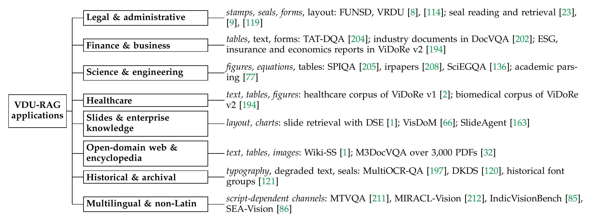

# Application domains (paper Fig. 11)

[Back to README](../README.md#paper-to-repository-map)

The domains with the greatest need lean on the least-studied channels (paper Table 7).

|Domain|Channels it depends on most|Representative systems and benchmarks|Papers|
|---|---|---|---|
|**Legal and administrative**|stamps, seals, forms; layout|FUNSD, VRDU; seal reading and retrieval|[FUNSD: A Dataset for Form Understanding in Noisy Scanned Documents](https://arxiv.org/abs/1905.13538), [VRDU: A Benchmark for Visually-rich Document Understanding](https://doi.org/10.1145/3580305.3599929), [ICDAR 2023 Competition on Reading the Seal Title](https://arxiv.org/pdf/2304.11966), [Logo and Seal Based Administrative Document Image Retrieval: A Survey](https://doi.org/10.1016/j.cosrev.2016.09.002), [SPODS: A Dataset of Color-Official Documents and Detection of Logo, Stamp, and Signature](https://doi.org/10.1007/978-3-319-68124-5_19)|
|**Finance and business**|tables; text, forms|TAT-DQA; industry documents in DocVQA; ESG, insurance and economics reports in ViDoRe v2|[Towards Complex Document Understanding by Discrete Reasoning](https://arxiv.org/abs/2207.11871), [DocVQA: A Dataset for VQA on Document Images](https://doi.org/10.1109/WACV48630.2021.00225), [ViDoRe Benchmark v2: Raising the Bar for Visual Retrieval](https://arxiv.org/abs/2505.17166)|
|**Science and engineering**|figures, equations; tables|SPIQA, irpapers, SciEGQA; academic parsing|[SPIQA: A Dataset for Multimodal Question Answering on Scientific Papers](https://arxiv.org/abs/2407.09413), [irpapers: A Visual Document Benchmark for Scientific Retrieval and Question Answering](https://arxiv.org/abs/2602.17687), [SciEGQA: A Dataset for Scientific Evidence-Grounded Question Answering and Reasoning](https://yuwenhan07.github.io/SciEGQA-project/), [Nougat: Neural Optical Understanding for Academic Documents](https://arxiv.org/abs/2308.13418)|
|**Healthcare**|text, tables, figures|healthcare corpus of ViDoRe v1; biomedical corpus of ViDoRe v2|[ColPali: Efficient Document Retrieval with Vision Language Models](https://openreview.net/forum?id=ogjBpZ8uSi), [ViDoRe Benchmark v2: Raising the Bar for Visual Retrieval](https://arxiv.org/abs/2505.17166)|
|**Slides and enterprise knowledge**|layout, charts|slide retrieval with DSE; VisDoM; SlideAgent|[Unifying Multimodal Retrieval via Document Screenshot Embedding](https://arxiv.org/abs/2406.11251), [VisDoM: Multi-Document QA with Visually Rich Elements Using Multimodal Retrieval-Augmented Generation](https://arxiv.org/abs/2412.10704), [SlideAgent: Hierarchical Agentic Framework for Multi-Page Visual Document Understanding](https://doi.org/10.18653/v1/2026.acl-long.677)|
|**Open-domain web and encyclopedia**|text, tables, images|Wiki-SS; M3DocVQA over 3,000 PDFs|[Unifying Multimodal Retrieval via Document Screenshot Embedding](https://arxiv.org/abs/2406.11251), [M3DocVQA: Multi-modal Multi-page Multi-document Understanding](https://openaccess.thecvf.com/content/ICCV2025W/Findings/html/Cho_M3DocVQA_Multi-modal_Multi-page_Multi-document_Understanding_ICCVW_2025_paper.html)|
|**Historical and archival**|typography; degraded text, seals|MultiOCR-QA, DKDS, historical font groups|[Evaluating Robustness of LLMs in Question Answering on Multilingual Noisy OCR Data](https://arxiv.org/abs/2502.16781), [DKDS: A Benchmark Dataset of Degraded Kuzushiji Documents with Seals for Detection and Binarization](https://doi.org/10.1007/s10032-026-00595-5), [ICDAR 2021 Competition on Historical Document Classification](https://doi.org/10.1007/978-3-030-86337-1_41)|
|**Multilingual and non-Latin**|script-dependent channels|MTVQA, MIRACL-Vision, IndicVisionBench, SEA-Vision|[MTVQA: Benchmarking Multilingual Text-Centric Visual Question Answering](https://aclanthology.org/2025.findings-acl.404/), [MIRACL-VISION: A Large, Multilingual, Visual Document Retrieval Benchmark](https://arxiv.org/abs/2505.11651), [IndicVisionBench: Benchmarking Cultural and Multilingual Understanding in VLMs](https://openreview.net/forum?id=LmJoLn04iL), [SEA-Vision: A Multilingual Benchmark for Comprehensive Document and Scene Text Understanding in Southeast Asia](https://openaccess.thecvf.com/content/CVPR2026/html/Yue_SEA-Vision_A_Multilingual_Benchmark_for_Comprehensive_Document_and_Scene_Text_CVPR_2026_paper.html)|

[Back to README](../README.md#paper-to-repository-map)
