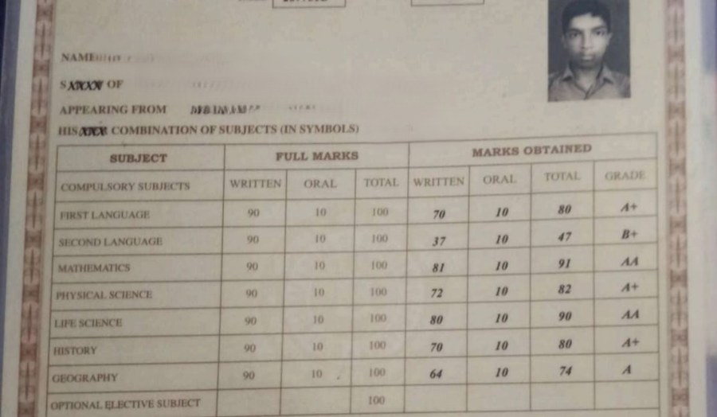

# Figures and Charts

[← Tables](tables.md) · [All eight channels](../../README.md#the-eight-channels) · [Equations →](equations.md)

*Example region of the figures and charts channel, as shown around the hub in paper Fig. 2.*

Graphical encodings of quantity that mean nothing until decoded through an axis. *Extraction* of the underlying data grew in document-analysis and vision venues and was surveyed in this journal; *question answering* grew from benchmarks and moved to realistic charts and structural extraction. A retriever that drops the mapping from position to value keeps what a chart looks like, not the values it shows.

## Coverage in the channel x paradigm matrix (paper Table 7)

|OCR -> LLM|MLLM-native|Text RAG|Visual RAG|
|:-:|:-:|:-:|:-:|
|✓|✓|✓|✓|

✓ results reported; ○ established task, but no method of that paradigm reports on it; ✗ nothing reported.

## Benchmarks that annotate this channel

- [ViDoRe v3](https://aclanthology.org/2026.acl-long.755/) (ACL 2026) · [link](https://arxiv.org/pdf/2601.08620)
- [MMDocIR](https://aclanthology.org/2025.emnlp-main.1576/) (EMNLP 2025) · [link](https://huggingface.co/MMDocIR)
- [MMDocRAG](https://scholar.google.com/scholar?q=Benchmarking+Retrieval-Augmented+Multimodal+Generation+for+Document+Question+Answering) (NeurIPS 2025) · [link](https://github.com/MMDocRAG/MMDocRAG)
- [M3DocVQA](https://openaccess.thecvf.com/content/ICCV2025W/Findings/html/Cho_M3DocVQA_Multi-modal_Multi-page_Multi-document_Understanding_ICCVW_2025_paper.html) (ICCVW 2025) · [link](https://github.com/bloomberg/m3docrag)
- [InfographicVQA](https://arxiv.org/abs/2104.12756) (WACV 2022) · [link](https://arxiv.org/pdf/2104.12756)
- [ChartQA](https://arxiv.org/abs/2203.10244) (ACL Find. 2022) · [link](https://github.com/vis-nlp/ChartQA)
- [SPIQA](https://arxiv.org/abs/2407.09413) (NeurIPS 2024) · [link](https://arxiv.org/pdf/2407.09413)
- [LongDocURL](https://aclanthology.org/2025.acl-long.57/) (ACL 2025) · [link](https://github.com/dengc2023/LongDocURL)
- [DocLayNet](https://doi.org/10.1145/3534678.3539043) (KDD 2022) · [link](https://github.com/DS4SD/DocLayNet)

## Benchmarks where the channel is present but not annotated

- [ViDoRe v1](https://openreview.net/forum?id=ogjBpZ8uSi) (ICLR 2025) · [link](https://arxiv.org/pdf/2407.01449)
- [ViDoRe v2](https://arxiv.org/abs/2505.17166) (arXiv 2025) · [link](https://arxiv.org/pdf/2505.17166)
- [ViDoSeek](https://aclanthology.org/2025.emnlp-main.464/) (EMNLP 2025) · [link](https://github.com/Alibaba-NLP/ViDoRAG)
- [UniDoc-Bench](https://arxiv.org/abs/2510.03663) (arXiv 2025) · [link](https://github.com/SalesforceAIResearch/UniDOC-Bench)
- [SciEGQA](https://yuwenhan07.github.io/SciEGQA-project/) (arXiv 2026) · [link](https://yuwenhan07.github.io/SciEGQA-project/)
- [MTVQA](https://aclanthology.org/2025.findings-acl.404/) (ACL Find. 2025) · [link](https://github.com/bytedance/MTVQA)

## Works cited for this channel in the paper

|Paper|Venue|Year|
|---|---|---|
|[Chart Mining: A Survey of Methods for Automated Chart Analysis](https://doi.org/10.1109/TPAMI.2020.2992028)|IEEE Trans. Pattern Anal. Mach. Intell.|2021|
|[PlotQA: Reasoning over Scientific Plots](https://arxiv.org/abs/1909.00997)|Proc. IEEE/CVF Winter Conf. Appl. Comput. Vis. (WACV)|2020|
|[ChartQA: A Benchmark for Question Answering about Charts with Visual and Logical Reasoning](https://arxiv.org/abs/2203.10244)|Findings of ACL|2022|
|[CharXiv: Charting Gaps in Realistic Chart Understanding in Multimodal LLMs](https://doi.org/10.52202/079017-3609)|Proc. Adv. Neural Inf. Process. Syst. (NeurIPS)|2024|
|[OneChart: Purify the Chart Structural Extraction via One Auxiliary Token](https://arxiv.org/abs/2404.09987)|Proc. ACM Int. Conf. Multimedia (ACM MM)|2024|

[Back to the channels](../../README.md#the-eight-channels)

[← Tables](tables.md) · [All eight channels](../../README.md#the-eight-channels) · [Equations →](equations.md)
