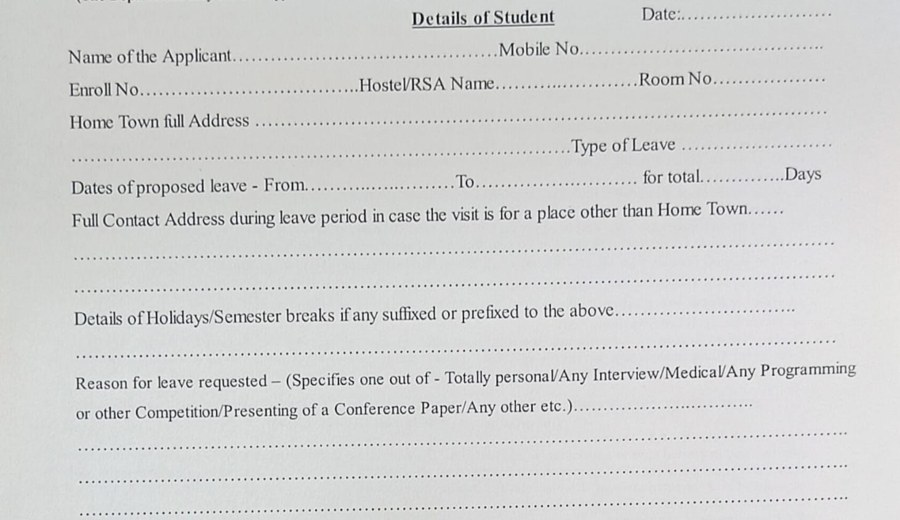

# Form Fields

[← Equations](equations.md) · [All eight channels](../../README.md#the-eight-channels) · [Stamps and seals →](stamps-and-seals.md)

*Example region of the form fields channel, as shown around the hub in paper Fig. 2.*

Key–value pairs bound by position rather than reading order, in layouts that vary between issuers; the history is written mostly in language venues. Datasets established the task and extended it to more languages; structural encoding addressed the binding; language-model extraction addressed unseen layouts; and benchmarks tested realistic and adversarial templates. As with layout, a pooled vector keeps the fields but not which key goes with which value.

## Coverage in the channel x paradigm matrix (paper Table 7)

|OCR -> LLM|MLLM-native|Text RAG|Visual RAG|
|:-:|:-:|:-:|:-:|
|✓|✓|✓|✓|

✓ results reported; ○ established task, but no method of that paradigm reports on it; ✗ nothing reported.

## Benchmarks that annotate this channel

- [FUNSD](https://arxiv.org/abs/1905.13538) (ICDARW 2019) · [link](https://guillaumejaume.github.io/FUNSD/)
- [VRDU](https://doi.org/10.1145/3580305.3599929) (KDD 2023) · [link](https://github.com/google-research-datasets/vrdu)

## Benchmarks where the channel is present but not annotated

- [ViDoRe v1](https://openreview.net/forum?id=ogjBpZ8uSi) (ICLR 2025) · [link](https://arxiv.org/pdf/2407.01449)
- [ViDoRe v2](https://arxiv.org/abs/2505.17166) (arXiv 2025) · [link](https://arxiv.org/pdf/2505.17166)
- [ViDoRe v3](https://aclanthology.org/2026.acl-long.755/) (ACL 2026) · [link](https://arxiv.org/pdf/2601.08620)
- [MMDocIR](https://aclanthology.org/2025.emnlp-main.1576/) (EMNLP 2025) · [link](https://huggingface.co/MMDocIR)
- [MMDocRAG](https://scholar.google.com/scholar?q=Benchmarking+Retrieval-Augmented+Multimodal+Generation+for+Document+Question+Answering) (NeurIPS 2025) · [link](https://github.com/MMDocRAG/MMDocRAG)
- [M3DocVQA](https://openaccess.thecvf.com/content/ICCV2025W/Findings/html/Cho_M3DocVQA_Multi-modal_Multi-page_Multi-document_Understanding_ICCVW_2025_paper.html) (ICCVW 2025) · [link](https://github.com/bloomberg/m3docrag)
- [ViDoSeek](https://aclanthology.org/2025.emnlp-main.464/) (EMNLP 2025) · [link](https://github.com/Alibaba-NLP/ViDoRAG)
- [UniDoc-Bench](https://arxiv.org/abs/2510.03663) (arXiv 2025) · [link](https://github.com/SalesforceAIResearch/UniDOC-Bench)
- [SciEGQA](https://yuwenhan07.github.io/SciEGQA-project/) (arXiv 2026) · [link](https://yuwenhan07.github.io/SciEGQA-project/)
- [DocVQA](https://doi.org/10.1109/WACV48630.2021.00225) (WACV 2021) · [link](https://arxiv.org/pdf/2007.00398)
- [LongDocURL](https://aclanthology.org/2025.acl-long.57/) (ACL 2025) · [link](https://github.com/dengc2023/LongDocURL)
- [MTVQA](https://aclanthology.org/2025.findings-acl.404/) (ACL Find. 2025) · [link](https://github.com/bytedance/MTVQA)

## Works cited for this channel in the paper

|Paper|Venue|Year|
|---|---|---|
|[FUNSD: A Dataset for Form Understanding in Noisy Scanned Documents](https://arxiv.org/abs/1905.13538)|Proc. ICDAR Workshops|2019|
|[XFUND: A Benchmark Dataset for Multilingual Visually Rich Form Understanding](https://doi.org/10.18653/v1/2022.findings-acl.253)|Findings Assoc. Comput. Linguistics: ACL|2022|
|[FormNet: Structural Encoding beyond Sequential Modeling in Form Document Information Extraction](https://arxiv.org/abs/2203.08411)|Proc. Annu. Meeting Assoc. Comput. Linguistics (ACL)|2022|
|[FormNetV2: Multimodal Graph Contrastive Learning for Form Document Information Extraction](https://doi.org/10.18653/v1/2023.acl-long.501)|Proc. Annu. Meeting Assoc. Comput. Linguistics (ACL)|2023|
|[LMDX: Language Model-based Document Information Extraction and Localization](https://arxiv.org/abs/2309.10952)|Findings of ACL|2024|
|[VRDU: A Benchmark for Visually-rich Document Understanding](https://doi.org/10.1145/3580305.3599929)|Proc. ACM SIGKDD Conf. Knowledge Discovery and Data Mining (KDD)|2023|
|[UNIKIE-BENCH: Benchmarking Large Multimodal Models for Key Information Extraction in Visual Documents](https://aclanthology.org/2026.acl-long.287/)|Proc. Annu. Meeting Assoc. Comput. Linguistics (ACL)|2026|

[Back to the channels](../../README.md#the-eight-channels)

[← Equations](equations.md) · [All eight channels](../../README.md#the-eight-channels) · [Stamps and seals →](stamps-and-seals.md)
