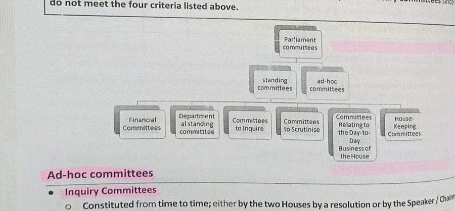

# Layout Structure

[← Plain text](plain-text.md) · [All eight channels](../../README.md#the-eight-channels) · [Tables →](tables.md)

*Example region of the layout channel, as shown around the hub in paper Fig. 2.*

Columns, blocks, headers, captions, reading order and containment. Layout is *relational*: a block's meaning depends on its neighbors. Geometric decomposition came first, detection followed large annotated corpora, and reading order and hierarchy became learnable targets. Another family injects layout into language models as tokens, positions or supervision.

## Coverage in the channel x paradigm matrix (paper Table 7)

|OCR -> LLM|MLLM-native|Text RAG|Visual RAG|
|:-:|:-:|:-:|:-:|
|✓|✓|✓|✓|

✓ results reported; ○ established task, but no method of that paradigm reports on it; ✗ nothing reported.

## Benchmarks that annotate this channel

- [ViDoRe v3](https://aclanthology.org/2026.acl-long.755/) (ACL 2026) · [link](https://arxiv.org/pdf/2601.08620)
- [MMDocIR](https://aclanthology.org/2025.emnlp-main.1576/) (EMNLP 2025) · [link](https://huggingface.co/MMDocIR)
- [UniDoc-Bench](https://arxiv.org/abs/2510.03663) (arXiv 2025) · [link](https://github.com/SalesforceAIResearch/UniDOC-Bench)
- [SciEGQA](https://yuwenhan07.github.io/SciEGQA-project/) (arXiv 2026) · [link](https://yuwenhan07.github.io/SciEGQA-project/)
- [InfographicVQA](https://arxiv.org/abs/2104.12756) (WACV 2022) · [link](https://arxiv.org/pdf/2104.12756)
- [LongDocURL](https://aclanthology.org/2025.acl-long.57/) (ACL 2025) · [link](https://github.com/dengc2023/LongDocURL)
- [DocLayNet](https://doi.org/10.1145/3534678.3539043) (KDD 2022) · [link](https://github.com/DS4SD/DocLayNet)

## Benchmarks where the channel is present but not annotated

- [ViDoRe v1](https://openreview.net/forum?id=ogjBpZ8uSi) (ICLR 2025) · [link](https://arxiv.org/pdf/2407.01449)
- [ViDoRe v2](https://arxiv.org/abs/2505.17166) (arXiv 2025) · [link](https://arxiv.org/pdf/2505.17166)
- [MMDocRAG](https://scholar.google.com/scholar?q=Benchmarking+Retrieval-Augmented+Multimodal+Generation+for+Document+Question+Answering) (NeurIPS 2025) · [link](https://github.com/MMDocRAG/MMDocRAG)
- [M3DocVQA](https://openaccess.thecvf.com/content/ICCV2025W/Findings/html/Cho_M3DocVQA_Multi-modal_Multi-page_Multi-document_Understanding_ICCVW_2025_paper.html) (ICCVW 2025) · [link](https://github.com/bloomberg/m3docrag)
- [ViDoSeek](https://aclanthology.org/2025.emnlp-main.464/) (EMNLP 2025) · [link](https://github.com/Alibaba-NLP/ViDoRAG)
- [DocVQA](https://doi.org/10.1109/WACV48630.2021.00225) (WACV 2021) · [link](https://arxiv.org/pdf/2007.00398)
- [TAT-DQA](https://arxiv.org/abs/2207.11871) (ACM MM 2022) · [link](https://github.com/NExTplusplus/TAT-DQA)
- [SPIQA](https://arxiv.org/abs/2407.09413) (NeurIPS 2024) · [link](https://arxiv.org/pdf/2407.09413)
- [MTVQA](https://aclanthology.org/2025.findings-acl.404/) (ACL Find. 2025) · [link](https://github.com/bytedance/MTVQA)
- [FUNSD](https://arxiv.org/abs/1905.13538) (ICDARW 2019) · [link](https://guillaumejaume.github.io/FUNSD/)
- [VRDU](https://doi.org/10.1145/3580305.3599929) (KDD 2023) · [link](https://github.com/google-research-datasets/vrdu)
- [PubTables-1M](https://arxiv.org/abs/2110.00061) (CVPR 2022) · [link](https://github.com/microsoft/table-transformer)
- [SPODS](https://doi.org/10.1007/978-3-319-68124-5_19) (ICVGIP-W 2017) · [link](https://facweb.iitkgp.ac.in/~jay/spods/index.html)
- [DKDS](https://doi.org/10.1007/s10032-026-00595-5) (IJDAR 2026) · [link](https://ruiyangju.github.io/DKDS/pdf/paper.pdf)
- [TexTAR](https://doi.org/10.1007/978-3-032-04614-7_16) (ICDAR 2025) · [link](https://arxiv.org/pdf/2509.13151)

## Works cited for this channel in the paper

|Paper|Venue|Year|
|---|---|---|
|[The Document Spectrum for Page Layout Analysis](https://doi.org/10.1109/34.244677)|IEEE Trans. Pattern Anal. Mach. Intell.|1993|
|[Segmentation of Page Images Using the Area Voronoi Diagram](https://scholar.google.com/scholar?q=Segmentation+of+Page+Images+Using+the+Area+Voronoi+Diagram)|Computer Vision and Image Understanding|1998|
|[PubLayNet: Largest Dataset Ever for Document Layout Analysis](https://arxiv.org/abs/1908.07836)|Proc. Int. Conf. Document Analysis and Recognition (ICDAR)|2019|
|[DocLayNet: A Large Human-Annotated Dataset for Document-Layout Segmentation](https://doi.org/10.1145/3534678.3539043)|Proc. ACM SIGKDD Conf. Knowledge Discovery and Data Mining (KDD)|2022|
|[LayoutReader: Pre-training of Text and Layout for Reading Order Detection](https://doi.org/10.18653/v1/2021.emnlp-main.389)|Proc. Conf. Empirical Methods in Natural Language Processing (EMNLP)|2021|
|[Graph-based Document Structure Analysis](https://openreview.net/forum?id=Fu0aggezN9)|Proc. Int. Conf. Learning Representations (ICLR)|2025|
|[A Bounding Box is Worth One Token: Interleaving Layout and Text in a Large Language Model for Document Understanding](https://aclanthology.org/2025.findings-acl.379/)|Findings Assoc. Comput. Linguistics: ACL|2025|
|[A Simple yet Effective Layout Token in Large Language Models for Document Understanding](https://openaccess.thecvf.com/content/CVPR2025/html/Zhu_A_Simple_yet_Effective_Layout_Token_in_Large_Language_Models_CVPR_2025_paper.html)|Proc. IEEE/CVF Conf. Comput. Vis. Pattern Recognit. (CVPR)|2025|
|[DocLayLLM: An Efficient Multi-modal Extension of Large Language Models for Text-rich Document Understanding](https://openaccess.thecvf.com/content/CVPR2025/html/Liao_DocLayLLM_An_Efficient_Multi-modal_Extension_of_Large_Language_Models_for_CVPR_2025_paper.html)|Proc. IEEE/CVF Conf. Comput. Vis. Pattern Recognit. (CVPR)|2025|

[Back to the channels](../../README.md#the-eight-channels)

[← Plain text](plain-text.md) · [All eight channels](../../README.md#the-eight-channels) · [Tables →](tables.md)
