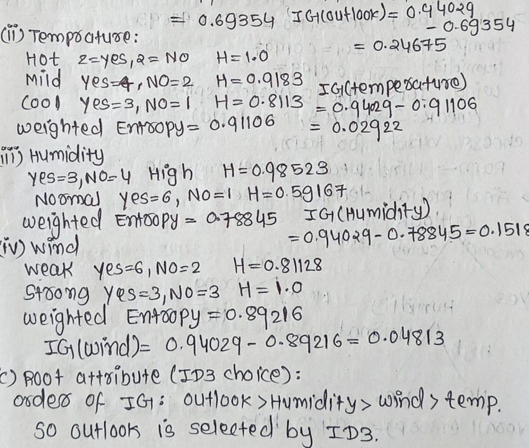

# Plain Text

[← Typography](typography.md) · [All eight channels](../../README.md#the-eight-channels) · [Layout →](layout-structure.md)

*Example region of the plain text channel, as shown around the hub in paper Fig. 2.*

The characters and their reading order; since order belongs to the layout, perfect character accuracy can still yield an unreadable stream. Four families recognize text: engineered recognizers, sequence models, OCR-free models that generate structured output from pixels, and compact vision-language models that emit markdown, layout and reading order together. Parsers now output this structure, while retrievers store vectors that keep none of it.

## Coverage in the channel x paradigm matrix (paper Table 7)

|OCR -> LLM|MLLM-native|Text RAG|Visual RAG|
|:-:|:-:|:-:|:-:|
|✓|✓|✓|✓|

✓ results reported; ○ established task, but no method of that paradigm reports on it; ✗ nothing reported.

## Benchmarks that annotate this channel

- [ViDoRe v1](https://openreview.net/forum?id=ogjBpZ8uSi) (ICLR 2025) · [link](https://arxiv.org/pdf/2407.01449)
- [ViDoRe v2](https://arxiv.org/abs/2505.17166) (arXiv 2025) · [link](https://arxiv.org/pdf/2505.17166)
- [ViDoRe v3](https://aclanthology.org/2026.acl-long.755/) (ACL 2026) · [link](https://arxiv.org/pdf/2601.08620)
- [MMDocIR](https://aclanthology.org/2025.emnlp-main.1576/) (EMNLP 2025) · [link](https://huggingface.co/MMDocIR)
- [MMDocRAG](https://scholar.google.com/scholar?q=Benchmarking+Retrieval-Augmented+Multimodal+Generation+for+Document+Question+Answering) (NeurIPS 2025) · [link](https://github.com/MMDocRAG/MMDocRAG)
- [M3DocVQA](https://openaccess.thecvf.com/content/ICCV2025W/Findings/html/Cho_M3DocVQA_Multi-modal_Multi-page_Multi-document_Understanding_ICCVW_2025_paper.html) (ICCVW 2025) · [link](https://github.com/bloomberg/m3docrag)
- [ViDoSeek](https://aclanthology.org/2025.emnlp-main.464/) (EMNLP 2025) · [link](https://github.com/Alibaba-NLP/ViDoRAG)
- [UniDoc-Bench](https://arxiv.org/abs/2510.03663) (arXiv 2025) · [link](https://github.com/SalesforceAIResearch/UniDOC-Bench)
- [SciEGQA](https://yuwenhan07.github.io/SciEGQA-project/) (arXiv 2026) · [link](https://yuwenhan07.github.io/SciEGQA-project/)
- [DocVQA](https://doi.org/10.1109/WACV48630.2021.00225) (WACV 2021) · [link](https://arxiv.org/pdf/2007.00398)
- [InfographicVQA](https://arxiv.org/abs/2104.12756) (WACV 2022) · [link](https://arxiv.org/pdf/2104.12756)
- [TAT-DQA](https://arxiv.org/abs/2207.11871) (ACM MM 2022) · [link](https://github.com/NExTplusplus/TAT-DQA)
- [SPIQA](https://arxiv.org/abs/2407.09413) (NeurIPS 2024) · [link](https://arxiv.org/pdf/2407.09413)
- [LongDocURL](https://aclanthology.org/2025.acl-long.57/) (ACL 2025) · [link](https://github.com/dengc2023/LongDocURL)
- [MTVQA](https://aclanthology.org/2025.findings-acl.404/) (ACL Find. 2025) · [link](https://github.com/bytedance/MTVQA)
- [FUNSD](https://arxiv.org/abs/1905.13538) (ICDARW 2019) · [link](https://guillaumejaume.github.io/FUNSD/)
- [VRDU](https://doi.org/10.1145/3580305.3599929) (KDD 2023) · [link](https://github.com/google-research-datasets/vrdu)
- [DocLayNet](https://doi.org/10.1145/3534678.3539043) (KDD 2022) · [link](https://github.com/DS4SD/DocLayNet)
- [TexTAR](https://doi.org/10.1007/978-3-032-04614-7_16) (ICDAR 2025) · [link](https://arxiv.org/pdf/2509.13151)

## Benchmarks where the channel is present but not annotated

- [ChartQA](https://arxiv.org/abs/2203.10244) (ACL Find. 2022) · [link](https://github.com/vis-nlp/ChartQA)
- [PubTables-1M](https://arxiv.org/abs/2110.00061) (CVPR 2022) · [link](https://github.com/microsoft/table-transformer)
- [UniMER](https://openaccess.thecvf.com/content/CVPR2026/html/Gu_UniMERNet_A_Universal_Network_for_Real-World_Mathematical_Expression_Recognition_CVPR_2026_paper.html) (CVPR 2026) · [link](https://github.com/opendatalab/UniMERNet)
- [SPODS](https://doi.org/10.1007/978-3-319-68124-5_19) (ICVGIP-W 2017) · [link](https://facweb.iitkgp.ac.in/~jay/spods/index.html)
- [ReST](https://arxiv.org/pdf/2304.11966) (ICDAR 2023) · [link](https://arxiv.org/pdf/2304.11966)
- [DKDS](https://doi.org/10.1007/s10032-026-00595-5) (IJDAR 2026) · [link](https://ruiyangju.github.io/DKDS/pdf/paper.pdf)

## Works cited for this channel in the paper

|Paper|Venue|Year|
|---|---|---|
|[An Overview of the Tesseract OCR Engine](https://doi.org/10.1109/ICDAR.2007.4376991)|Proc. Int. Conf. Document Analysis and Recognition (ICDAR)|2007|
|[TrOCR: Transformer-Based Optical Character Recognition with Pre-trained Models](https://arxiv.org/abs/2109.10282)|Proc. AAAI Conf. Artificial Intelligence|2023|
|[OCR-free Document Understanding Transformer](https://arxiv.org/abs/2111.15664)|Proc. Eur. Conf. Comput. Vis. (ECCV)|2022|
|[End-to-End Document Recognition and Understanding with Dessurt](https://arxiv.org/abs/2203.16618)|Proc. Eur. Conf. Comput. Vis. Workshops (ECCVW)|2022|
|[DocParser: End-to-End OCR-free Information Extraction from Visually Rich Documents](https://arxiv.org/abs/2304.12484)|Proc. Int. Conf. Document Analysis and Recognition (ICDAR)|2023|
|[TextMonkey: An OCR-free Large Multimodal Model for Understanding Document](https://doi.org/10.1109/tpami.2026.3653415)|IEEE Trans. Pattern Anal. Mach. Intell.|2026|
|[dots.ocr: Multilingual Document Layout Parsing in a Single Vision-Language Model](https://arxiv.org/abs/2512.02498)|arXiv preprint arXiv:2512.02498|2025|
|[MonkeyOCR: Document Parsing with a Structure-Recognition-Relation Triplet Paradigm](https://arxiv.org/abs/2506.05218)|arXiv preprint arXiv:2506.05218|2025|
|[PaddleOCR-VL: Boosting Multilingual Document Parsing via a 0.9B Ultra-Compact Vision-Language Model](https://arxiv.org/abs/2510.14528)|arXiv preprint arXiv:2510.14528|2025|

[Back to the channels](../../README.md#the-eight-channels)

[← Typography](typography.md) · [All eight channels](../../README.md#the-eight-channels) · [Layout →](layout-structure.md)
