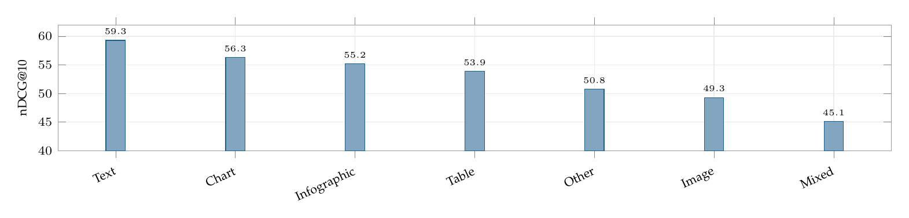

# Metrics and evaluation

[⬅ Back to README](../README.md) · [◀ Datasets and benchmarks](datasets-and-benchmarks.md) · [RAG, retrieval and review-method foundations ▶](foundations.md)

Page-level relevance and string similarity cannot say which content was responsible. The survey proposes a channel-aware score (CARS).

*ViDoRe v3, best retriever in the release: nDCG@10 by content type of the evidence (values from the benchmark paper, Table 15).*

* [arXiv 2025] **Are We on the Right Way for Assessing Document Retrieval-Augmented Generation?** [[arXiv](https://arxiv.org/abs/2508.03644)]
* [arXiv 2025] **RAG-Check: Evaluating Multimodal Retrieval Augmented Generation Performance** [[arXiv](https://arxiv.org/abs/2501.03995)]
* [SIGIR 2024] **Evaluating Retrieval Quality in Retrieval-Augmented Generation** [[DOI](https://doi.org/10.1145/3626772.3657957)]
* [SIGIR 2024] **The Power of Noise: Redefining Retrieval for RAG Systems** [[DOI](https://doi.org/10.1145/3626772.3657834)]

---
[⬅ Back to README](../README.md) · [◀ Datasets and benchmarks](datasets-and-benchmarks.md) · [RAG, retrieval and review-method foundations ▶](foundations.md)
